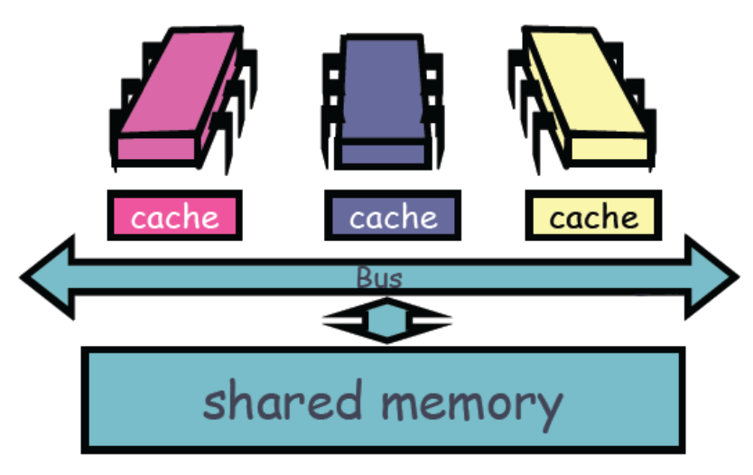
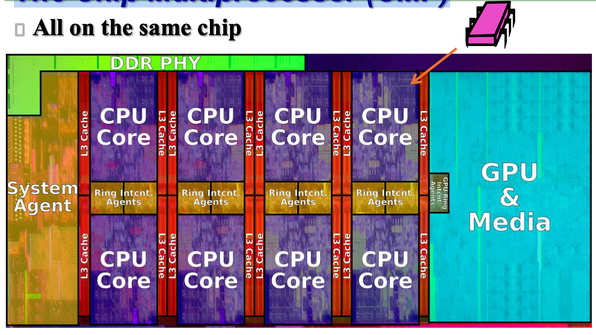
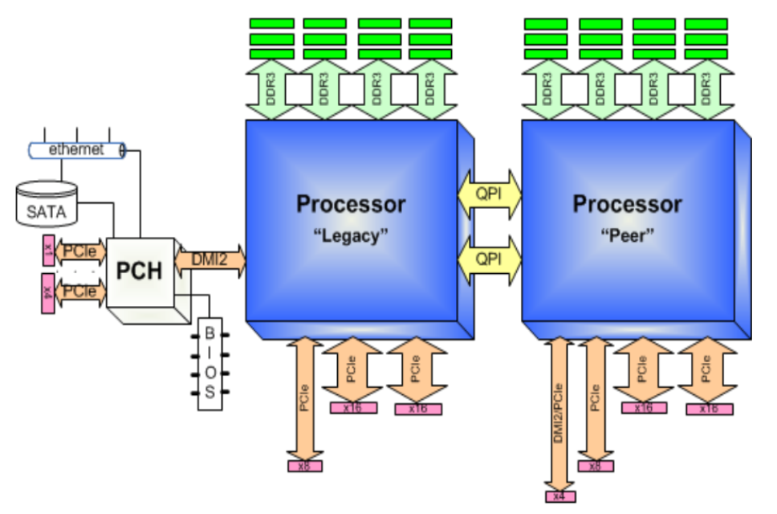
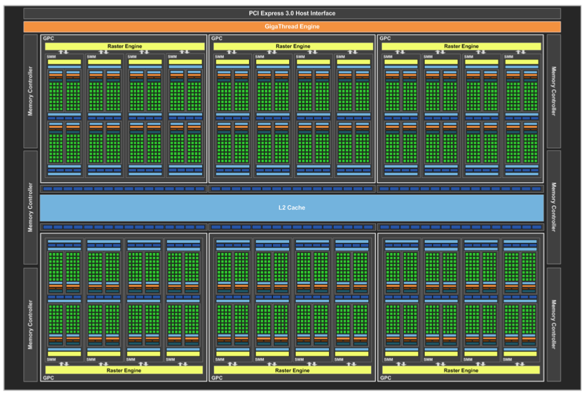
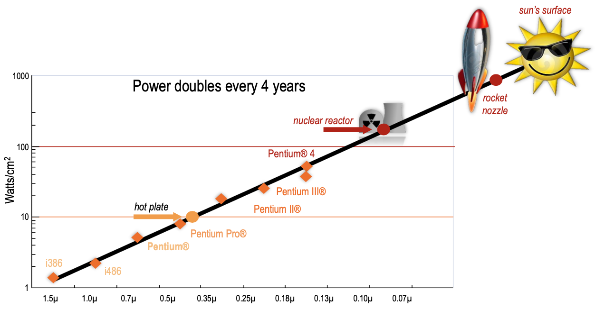
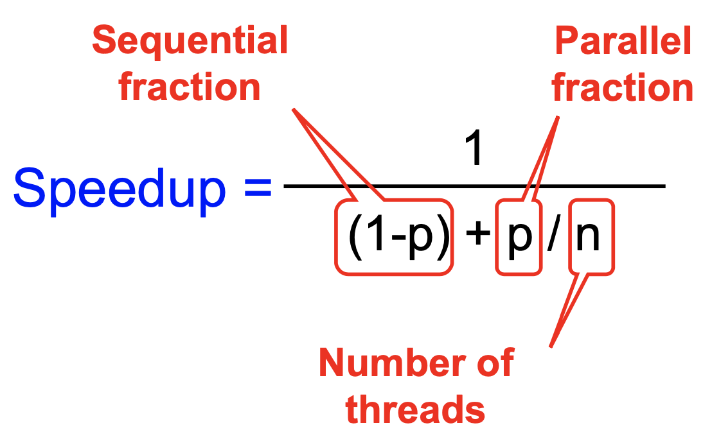
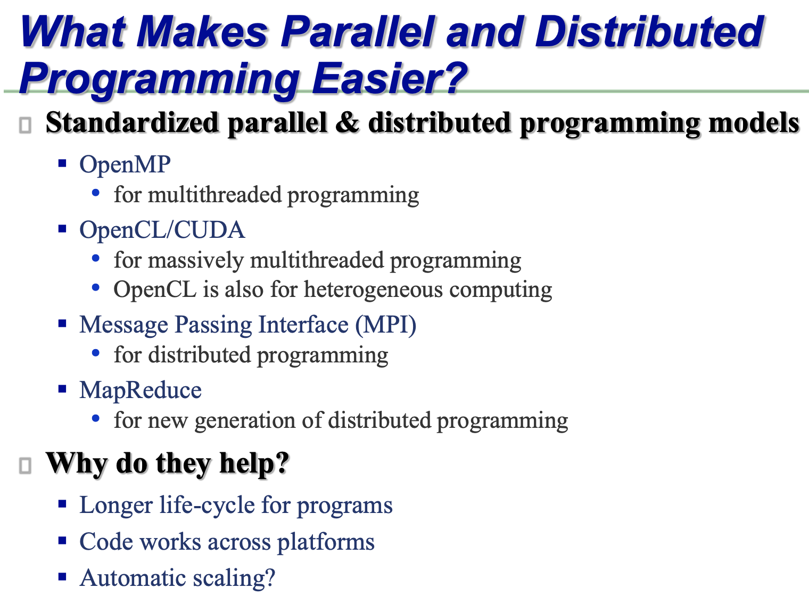

# 01 Introduction

### 单处理器

一个CPU，关联着它的cache

支持顺序编程

### 关于服务器

#### 传统服务器：Shared Memory Multiprocessor (SMP)

多芯片：每个处理器芯片（chip）有一个自己的CPU和自己的cache，通过总线连接到共享的内存上

#### 现代处理器：The Chip Multiprocessor (CMP)（多处理器）

所有的CPU和他们各自的cache都在同一个芯片（chip）上

#### 各种各样的处理器

**2-Socket 4-channel DDR3 (NUMA)**

**显卡 Titan X**

**AlphaGo**

**云计算**

**耳机**

**......**

### 结论：计算系统越来越复杂

原因：摩尔定律

> 集成电路上可容纳的晶体管数目，约每隔两年便会增加一倍；经常被引用的“18个月”，是由英特尔首席执行官大卫·豪斯（David House）提出：预计18个月会将芯片的性能提高一倍（即更多的晶体管使其更快），是一种以倍数增长的观测。

> **Dennard scaling（Dennard缩放比例定律）**：随着晶体管变得越来越小，它们的功率密度保持不变，因此功率的使用与面积成比例；电压和电流的规模与长度成比例。

阻碍：**Power Barrier：if we keep frequency scaling, power goes up exponentially**

那么，如何才能制造更快的处理器？

1990s：

- 加快时钟周期

  实现方法：更多层流水线；更多&更短的阶段划分

  问题：到达一定程度后芯片会太热

- 超标量处理器

  实现方法：同时处理多条指令（ILP，指令级并行）；分支预测

  问题：回报减少

摩尔定律重新诠释：

- 每个芯片上的核数，每过两年翻一番
- 时钟周期不会增加，甚至可能减少
- 需要处理多线程并发的问题
- 需要处理芯片内并行与芯片间并行
- 需要处理芯片的异构性与专业化的问题（并非所有芯片都一样）

### 并发编程需要注意的问题

- 找到足够多的并行部分（Amdahl's Law）

  > Amdahl's Law
  >
  > 假设程序只有一部分可以并行化
  >
  > 如果顺序执行的部分太多，意味着性能会受到影响
  >
  > 不是线性关系
  >
  > 即使并行部分优化得很好，串行部分的性能也会受到影响

- 加速比
  $$
  Speedup=\frac{1\,thread\,execution\,time}{n \,thread\, execution\,time}
  $$
  

- 由Amdahl's Law，看起来并发编程的效率会随着处理器数量的增加而增大，但实际上并不是

  - 因为同步(Synchronization)的问题会拖慢速度

- 编程时需要注意：
  - 粒度
  - 局部性
  - 负载均衡
  - 协调性与同步

### 通过扩展得到更大规模的并行

#### 云计算

##### 互联网可以看成是一个大的并行与分布式计算环境

**The “cloud”:** A set of computers on the internet available on demand, like a public utility

可以作为一种服务租赁给外界

##### 云计算面临的挑战

- 有许多节点组成的网络，故障率会增加
  - 比如，一个节点平均故障间隔为3年，1000个节点的网络平均故障时间为1天
  - 解决方法：限制编程模型，建立对故障的容忍度
- 商品网络造成带宽很低
  - 解决方法：将计算推入数据

### 并发编程的工具 

----

## 附录

### 并行编程模型的分类

#### 共享内存

[共享内存](https://zh.wikipedia.org/wiki/共享内存)是在进程间传递数据的高效方式。在共享内存模型中，并行进程共享它们可以==异步==读与写的==全局地址空间==。异步并发访问可能导致[竞争条件](https://zh.wikipedia.org/wiki/竞争条件)，和用来避免它们的机制如：[锁](https://zh.wikipedia.org/wiki/锁_(计算机科学))、[信号量](https://zh.wikipedia.org/wiki/信号量)和[监视器](https://zh.wikipedia.org/wiki/监视器_(程序同步化))。常规的[多核处理器](https://zh.wikipedia.org/wiki/多核处理器)直接支持共享内存，很多并行编程语言和库在设计上利用了它，比如采用[Fork-join模型](https://zh.wikipedia.org/wiki/Fork-join模型)的：[Cilk](https://zh.wikipedia.org/wiki/Cilk)、[OpenMP](https://zh.wikipedia.org/wiki/OpenMP)和[线程建造块](https://zh.wikipedia.org/w/index.php?title=线程建造块&action=edit&redlink=1)[[6\]](https://zh.wikipedia.org/wiki/并行编程模型#cite_note-TBB-6)。

#### 分布式内存

[分布式内存](https://zh.wikipedia.org/w/index.php?title=分布式内存&action=edit&redlink=1)指称一类[==多处理器计算机系统==](https://zh.wikipedia.org/wiki/多處理器)，其中==每个[处理器](https://zh.wikipedia.org/wiki/CPU)都有自己私有的[内存](https://zh.wikipedia.org/wiki/内存)==，计算任务只能在本地数据上运算，如果需要远程数据，计算任务必须与一个或多个远程处理器通信。在分布式内存系统编程中的==关键要点是如何把数据分布到各个内存上==；依赖于所解决的问题，数据可以静态分布，也可以在节点间移动；数据可以在需要时移动，也可以事先推入新的节点。

[MPI](https://zh.wikipedia.org/wiki/MPI)规定了用于分布式内存系统的[通信协议](https://zh.wikipedia.org/wiki/通信协议)，支持点到点通信和集体通信（collective communication）二者。MPI还是[消息传递](https://zh.wikipedia.org/wiki/消息传递)[API](https://zh.wikipedia.org/wiki/应用程序接口)，带有对其特征在任何实现中必须如何表现的协议和语义规定[[7\]](https://zh.wikipedia.org/wiki/并行编程模型#cite_note-7)。MPI的目标是高性能、可伸缩性和可移植性，当前仍是[高性能计算](https://zh.wikipedia.org/wiki/高性能計算)领域中统治性的模型[[8\]](https://zh.wikipedia.org/wiki/并行编程模型#cite_note-8)。此外还有支持单边通信（one-sided communication）的[分区全局地址空间](https://zh.wikipedia.org/wiki/分区全局地址空间)模型。

