#  02 ProgModels

[TOC]

## 编程模型与体系结构

### 计算机体系结构

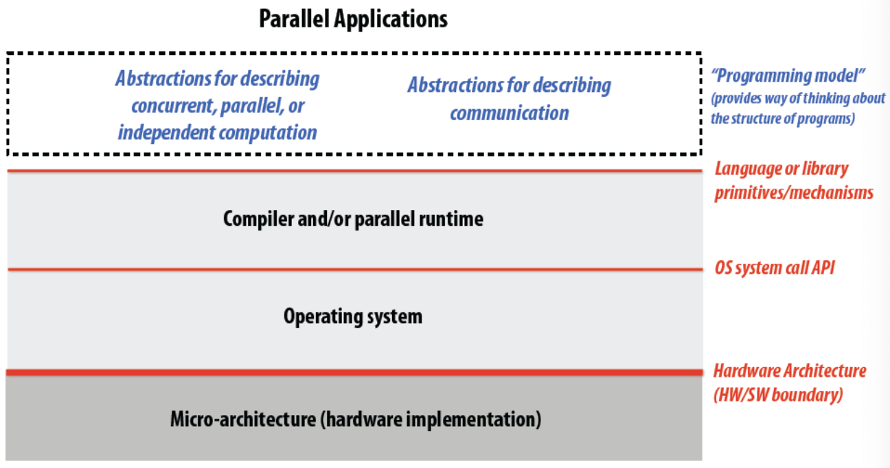

### 三种并发编程模型

#### Shared address space ==(SAS)==

线程之间共享地址空间，通过读写同一变量来交流

##### 硬件实现

出发点：每个处理器都能直接访问到任何内存地址

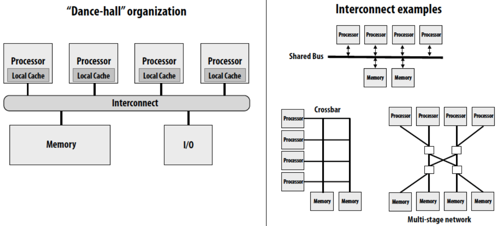

> 一种特殊的设计：**Non-uniform Memory Access ==(NUMA)==**
>
> 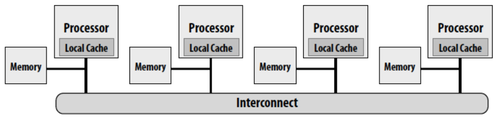
>
> 内存访问平均的系统存在问题：可扩展性
>
> NUMA可扩展性更好
>
> NUMA的问题：对于性能问题更难调试

#### Message passing

 线程有各自独立的内存空间，通过发送/接收消息来交流（类似于ics里process之间发送signal）

常用库：MPI

> 这两种编程模型与线程间交流方式并无直接联系
>
> 共享地址空间的机器也可以实现message passing模型
>
> 不支持共享地址空间的机器也可以实现Shared address space模型

#### Data parallel

比如向量加法

现在常表现为SPMD

### 三种机器的体系结构

根据指令流与数据流的数目对机器进行分类：

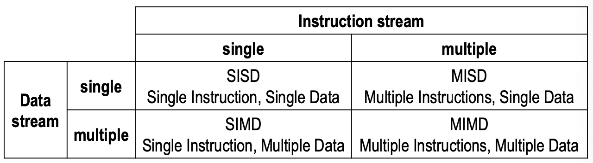

编程模型都趋于SPMD

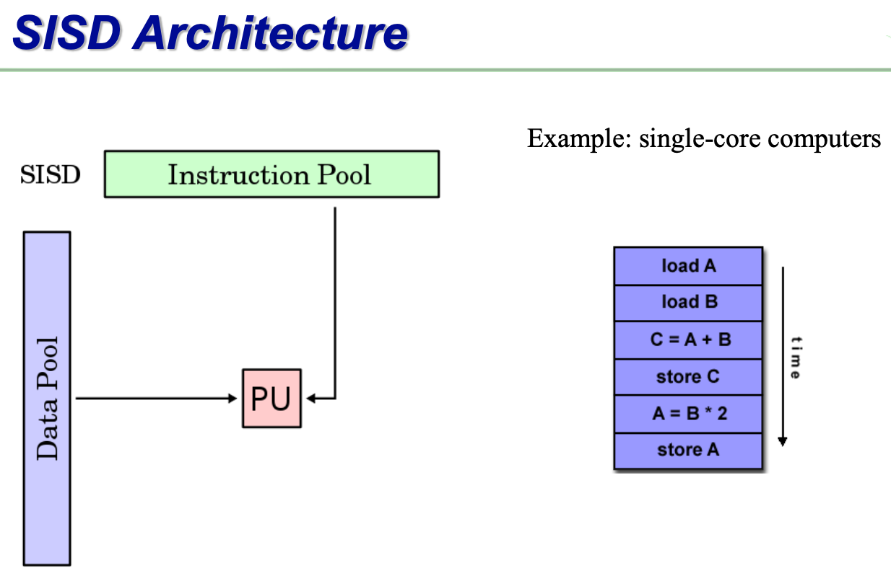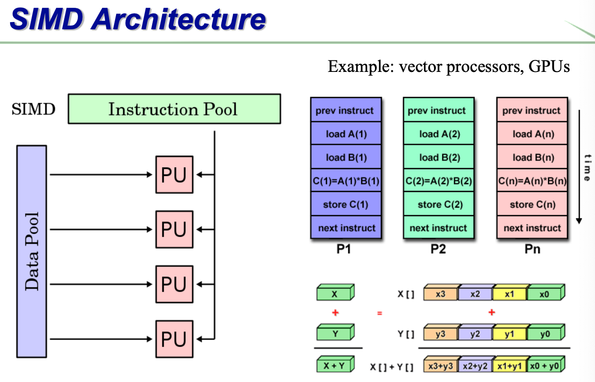

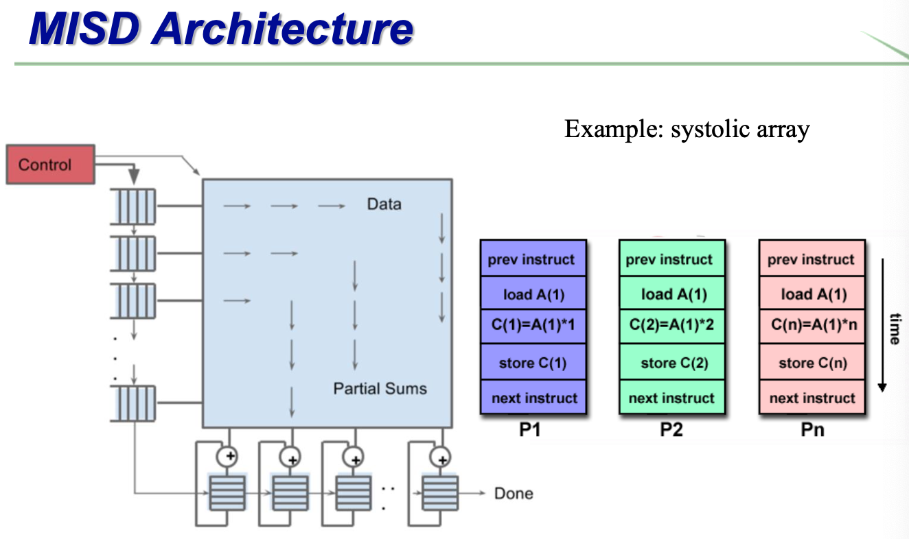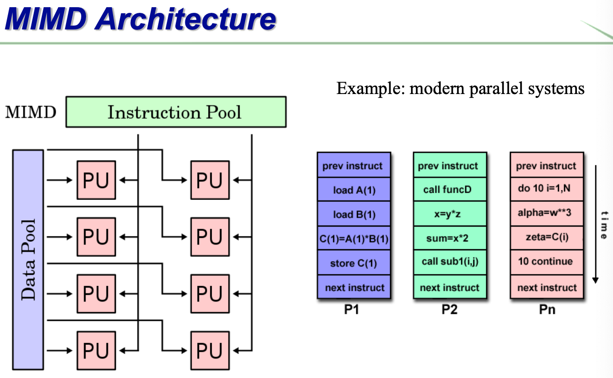

对MIMD的进一步划分

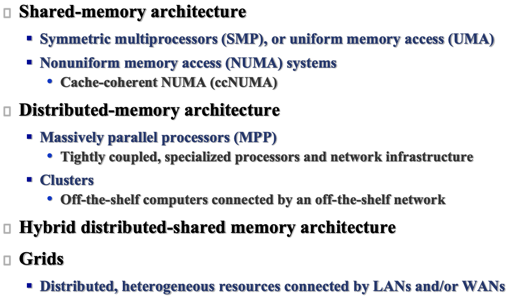

#### Shared-Memory Architecture

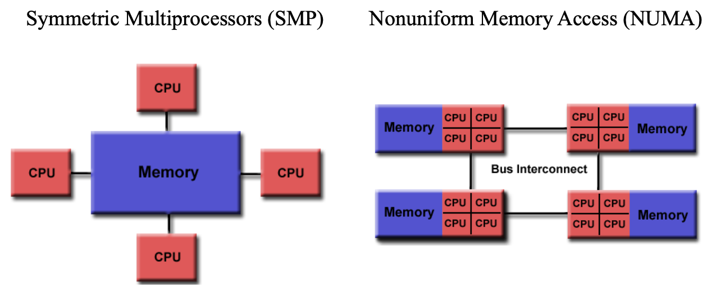

#### Distributed-Memory Architecture

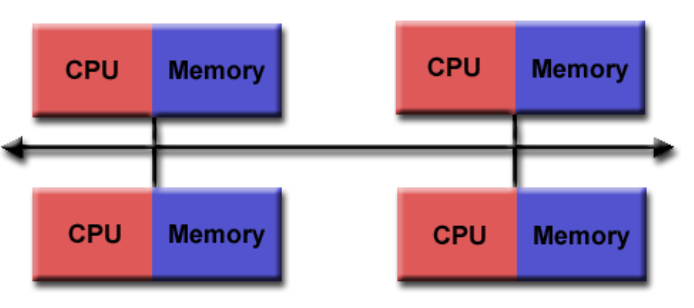

#### Hybrid Architecture

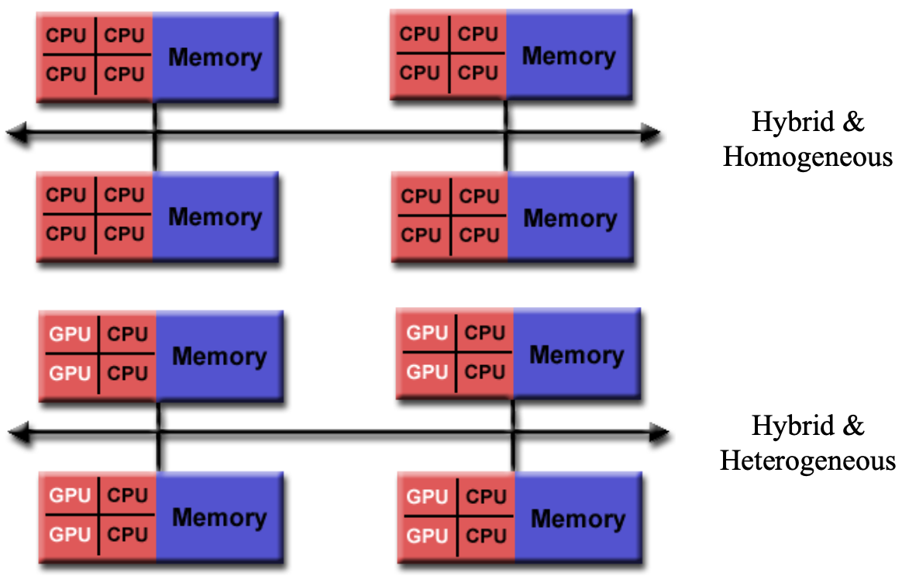

## 设计并行程序的思路

### 增加并行性

寻找程序瓶颈或并行的机会

尽量让所有的处理器都不闲着

### Foster’s Design Methodology

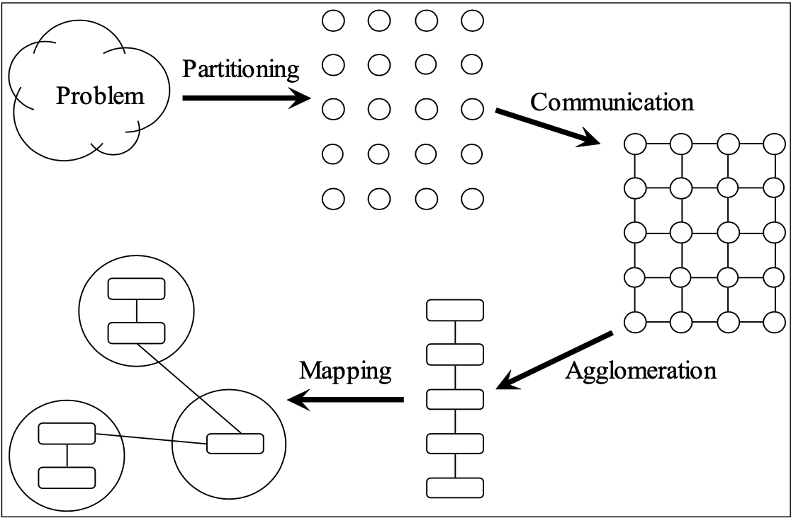

#### Partitioning

将==计算==和==数据==分块

##### 利用数据的并行性

- 划分数据（哪些数据分给哪个处理器）
- 决定如何将数据与计算联系起来（每个处理器都要做什么）

##### 利用任务的并行性

- 划分任务/计算（哪些任务分给哪个处理器）
- 决定如何将数据与计算联系起来（每个处理器都要处理哪些数据）

##### 利用流水线的并行性

优化循环语句

两个概念：

- 启动间隔**Initiation Interval(II)**
  - Number of cycles that must elapse between two loop iterations
  - II=1是最好情况，但由于==访问冲突（两个过程都要对同一个数做某种运算，有一个必须等）==和==数据依赖==，可能达不到1
- 吞吐量**Throughput**
  - Amount of work done over a period of time (often per unit time)
- II=1:arrow_right:Throughput is maximized

##### 操作要点

- 原始任务数量至少是处理器数量10倍起步
  - 否则后面设计时可能会受到限制
- 减少冗余的数据存储和计算
  - 否则问题规模变大的时候效果会变差
- 原始任务数量要大小差不多
  - 否则处理器之间不容易平衡工作量
- 任务数量要随问题规模的增大而增大
  - 否则，可能不适于用更多的处理器解决更大规模的问题（无法充分发挥处理器数目的优势）

#### Communication

##### 决定任务之间的值传递

任务间的交流图

##### Local communication

一个任务 需要其他少数几个任务给它传值

##### Global communication

大量任务为了一个计算而贡献数据

不要一开始就设计channel

##### 操作要点

- 任务间通讯操作要平衡
- 每个任务之和少数其他任务交流
- 任务可以并行地交流
- 任务可以并行地计算

#### Agglomeration

把小任务合并成大的任务

目标：优化性能 保持可扩展性 简化编程

<u>在信息传递的编程模型中，一般一个处理器分配一个合并后的任务</u>

##### 要点

- 并行计算的局部性提升了
- 重复计算替代了通信，它们耗时更短
- 数据复制不影响可扩展性
- 合并后的任务有相似的计算和通信代价
- 问题规模增大时，任务数也增加
- 任务数适合目标系统
- 要在合并任务与代码修改的代价之间取舍

#### Mapping

将任务分配给处理器

- 集中式处理器：映射由OS完成
- 分布式内存系统：由用户完成映射

Mapping的两个目标：

- 增大处理器利用率
- 减少处理器之间的交流

##### 寻找最佳分配

NP-hard

> Mapping决策树
>
> ==待完成==

##### 操作要点

- 一个处理器对应一个任务/多个任务
- 评估并选择静态/动态的任务分配方式
  - 静态任务分配：任务分配器的行为不是性能瓶颈
  - 动态任务分配：任务数至少为处理器的10倍