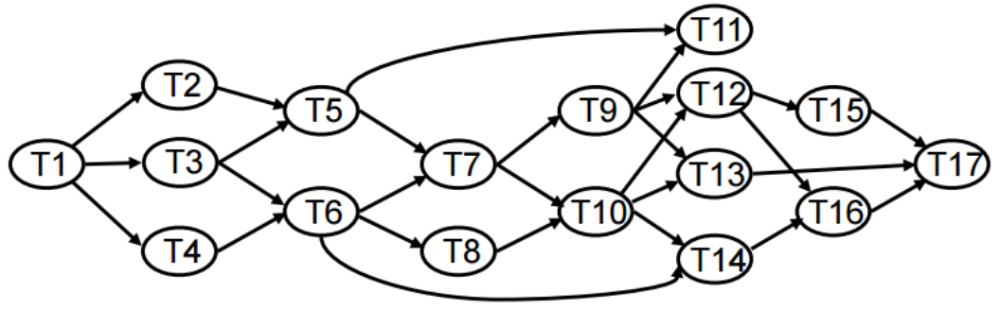
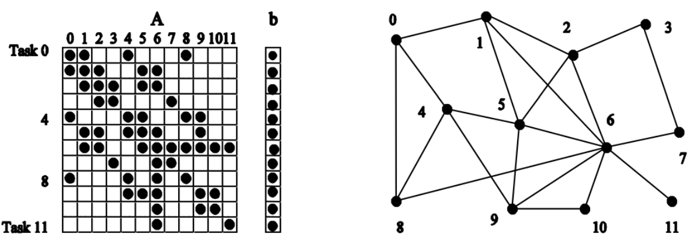
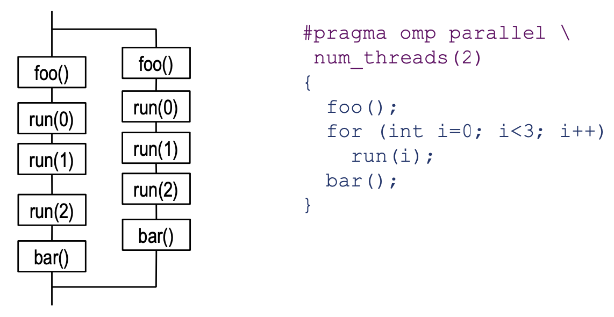
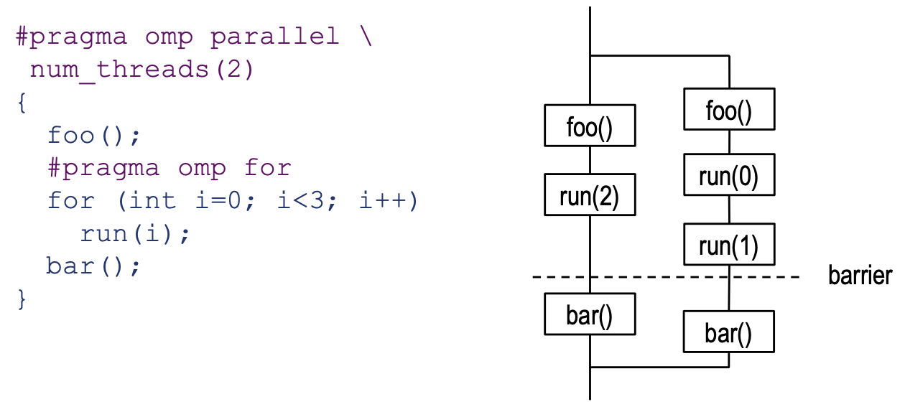
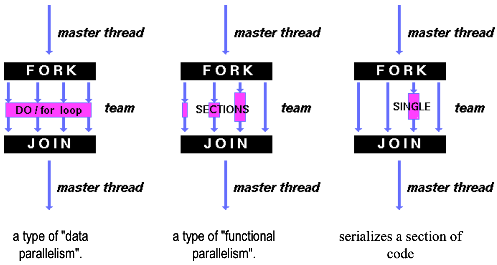
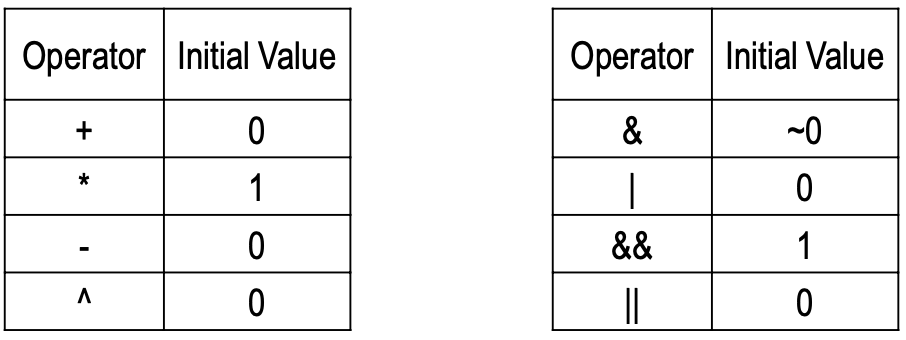

# 03 Programming with OpenMP

[TOC]

## 基础概念

### 任务依赖图&任务通信图

#### 任务依赖图——==控制依赖==

#### 任务通信图——==数据依赖==

- 任务间需要数据交换
  - node = task
  - edge = interaction or data exchange

一个例子：矩阵与向量相乘

任务划分（粒度）的影响：

- 节点0视为一个任务：communication=3;computation=4
- 节点0,4,5视为一个任务：communication=5;computation=15
- 粒度越大，$\frac{communication}{computation}$越小

### 并行度&关键路径

几个概念

- 并行度：同时执行的任务数量    ==可能随着程序的运行而变化==
  - 最大并行度：在某一时刻达到的最大值
  - 平均并行度：全过程，每个时刻的并行度，对时间加权平均
- 粒度：划分的任务的大小

==并行度与粒度负相关==

- 关键路径
  - 图中耗时（权重）最高的路线
  - 程序执行时间的下界（都大于等于它）

> 什么会限制并行程序的运行时间？
>
> - 任务的粒度有最小限制（任务数有最大限制）
> - 任务间依赖
> - 并行的代价（eg任务间的通信）
> - 有些过程不能并行化

### 加速比&效率

- 加速比
  $$
  Speedup=\frac{T_1}{T_p}
  $$
  
- 效率
  $$
  parallel\,efficiency=\frac{T_1}{pT_p}
  $$

### 线程&映射

=="#" means "number"==

- 一般来说 任务数>线程数
- 为什么说“线程数”而不说“核数”？
  - 把任务和数据分配给线程
  - OS将线程分配给核

#### Mapping的原则

- 将独立的任务分配给不同线程
- 让线程间交流尽量的少

- 将关键路径上的任务尽早分配给线程

## OpenMP基础

基于线程的fork/join模型

### OpenMP三个要素

#### 编译指令

pragma：C/C++编译器的编译指令

由预处理器处理，编译器不管它们

pragma的句法：==\#pragma omp < directive-name > [clause, ...]==

#### 运行时库例程

- int omp_get_num_procs(void)
  - 返回处理器的数量
- void omp_set_num_threads(int t)
  - 设置parallel块内活跃的线程数目

#### 环境变量

### 一些pragma预编译命令

#### #pragma omp parallel for

下面的for循环可以并行执行

##### 注意事项

- 运行时的循环次数，在循环体执行前必须能计算出来
- 循环体不能包含break,return,exit
- 循环体不能包含跳到循环体外的goto
- 每次迭代要彼此独立
- 线程在循环体结尾会等着
- 每个parallel for语句都代表了一次fork和一次join，会有额外代价，所以每次用parallel for都要尽可能多做一些事（尽可能增大粒度）

#### parallel

它块内的任务可以并行执行==（“块”由大括号标志。如果没有大括号，就是紧接着它的C++意义上的语句块）==

SPMD风格的编程

比parallel for相比，可以并行的内容不再仅限于for循环体

- parallel下的内容，是==多个线程同步执行==的，==会有重复==
- 但如果parallel下有for，则==for下的内容只执行一次==，但==瓜分给不同线程==

#### 用在parallel下的几个指令

##### for

- 必须在parallel块的作用域下使用才有效

- 线程们==瓜分==循环里的内容

- for循环的结尾处自带barrier synchronization，线程到那里会同步

##### single

- 只有一个线程去执行块中的语句（不指定具体哪个线程）
- 其余的线程
  - 默认情况：在块结尾处等待
  - 加了nowait指令：不等

- 当块中语句为**线程不安全的**时会有用（比如I/O）

##### master

- 指定主线程（0号线程）执行块中的内容

##### section/sections

- 把要做的事情划分成几块，每块分给一个线程（但一个线程可能执行好几个块）
- 先用sections表明要被划分的区域
  - 它下面的块里，每个section指令划分出一块

#### reduction

> 有些循环体中，各次循环之间存在数据依赖（如累加、累乘）
>
> reduction可以解决这个问题，使得它还能够被瓜分给不同的thread

<u>#pragma omp ... reduction (op : list)</u>

​		op代表了要做什么运算（运算符），list是哪个数组要做这种运算

- 可以用在parallel、for、sections中
- 每个thread都分到若干个iteration，分别在自己私有的变量中进行计算，最后把基础值和各线程计算结果汇总到一起。

- 运算的初值：每个线程计算的时候，结果的初始值是什么？

  就是该种运算的单位元

  

- reduction时声明了运算类型和操作数组，编程时不能改成别的。初值是根据你的声明选的，可能与实际运算对应的初值不符，造成错误

### OpenMP的问题

- 编译器不检查诸如Deadlock和Race condition这样的错误