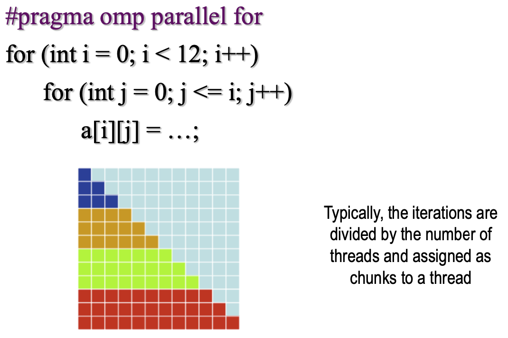

# Decomposition Techniques

[TOC]

## 划分技术

##### 划分的粒度

与任务数量有关

## OpenMP的实现

如果用一般的划分方式：iteration按照thread的数目被划分

循环体被划分的方式（Loop Scheduling）：

- 静态划分：在执行前就被划分给不同thread
- 动态划分：在执行过程中被划分给thread

schedule命令决定了会如何划分

### schedule命令

#### 静态调度

`schedule (static [, chunk])`

- 将循环体分成大小为‘chunk’的块，分配给thread
- 用在==每个iteration工作量相近==且==可预测==的情况下效果最佳
- 开销低，可能造成负载不平衡

#### 动态调度

`schedule (dynamic [, chunk])`

- thread现场分配iterations，完成一个请求下一个
- 更高的线程开销，可以减少负载不平衡
- 用于==不可预测==或==多样化==的工作中效果最佳

#### Guided调度

`schedule (guided [, chunk])`

- 类似于动态调度，但每次分配的循环次数不同
- 开始比较大，以后逐渐减小
  - 一开始的块大小：正比于 总迭代次数/线程数
  - 之后的块大小：正比于 剩余迭代数/线程数
- Chunk表示每次分配的迭代次数的最小值，由于每次分配的迭代次数会逐渐减少，较少到size时，将不再减少。<u>如果不知道size的大小，那么默认size为1，即一直减少到1。</u>
- 在计算逐渐耗时的时候使用，效果最佳，可以减少调度开销

## 划分技术（续）

### data decomposition

分解问题，根据不同任务进行数据划分

划分的思路：

- 根据输入数据划分
  - 如果每个输出都是输入的一个函数，这种策略是最合适的
  - 如果不清楚输出是什么，则这可能是唯一自然的划分方式
  - 后续的过程会把早期任务得到的中间结果合并起来
- 根据输出数据划分
  - 适用于输出数据的每个元素都能被独立地计算的情况
  - eg矩阵的分块乘法
- 根据输入数据和输出数据划分
- 根据中间数据划分
  - 先分成几个stage

### recursive decomposition

常用于分治策略

递归的边界：达到最小粒度

#### 用OpenMP实现递归式划分

要允许不同规格的问题并行，需要建立task的概念

==Tasks==

- 是独立的工作单元

  - 每个Task都由一个thread完成
  - Task可能彼此不同
  - Task可能马上要被执行

  由OS调度

- 创建任务&认领任务

  

  ==$\uparrow\uparrow\uparrow$注意此图中task的作用域只有process(p)一个语句==

  ==这里假设process(p)不会改p==

  <u>T thread 控制p遍历链表、创建任务（到任务池中），另外一些线程认领任务并完成</u>

- 如何保证任务都被完成？
  - Thread or task barriers(Implicit)
  - 通过`#pragma omp barrier`命令(Explicit)
    - 所有thread都会被同步
  - 通过`#pragma omp taskwait`命令
    - 只有任务开始时建立的thread会被同步（？）

### exploratory decomposition

在状态空间中搜索

### speculative decomposition

#### Conservative approach

task完全独立时才视为独立（并行性差）

#### Optimistic (speculative) approach

task有可能不独立，但也视为独立（可能出错）

需要回滚机制

> **Speculative vs exploratory**
>
> **Speculative**：工作量>=串行
>
> **exploratory**：工作量>=<串行 均有可能