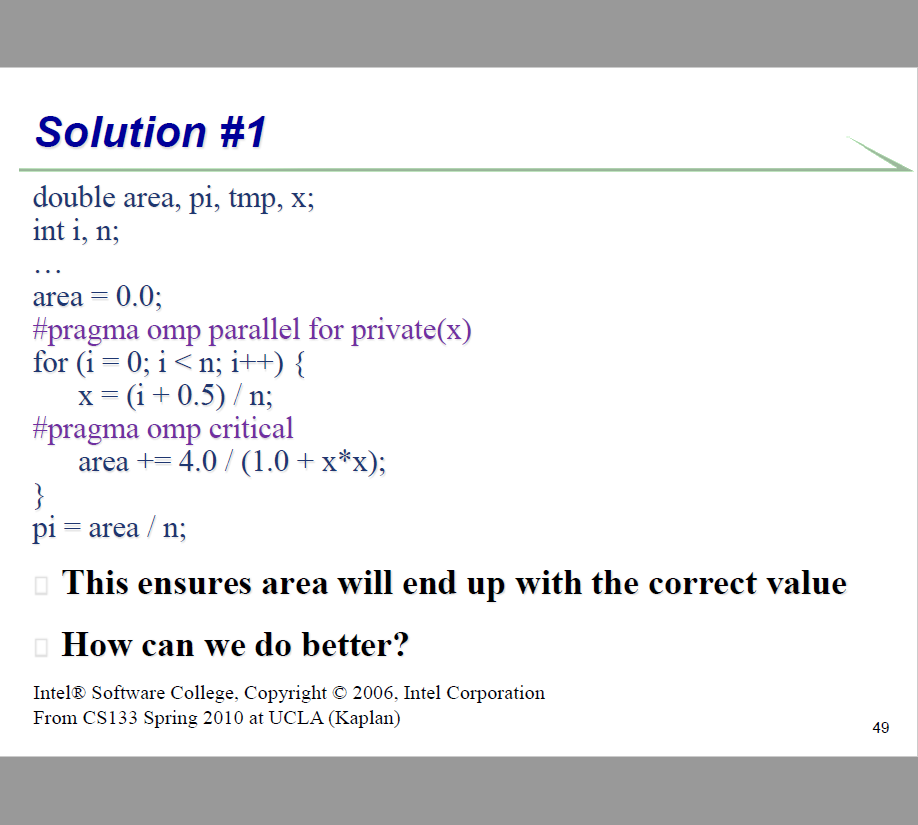
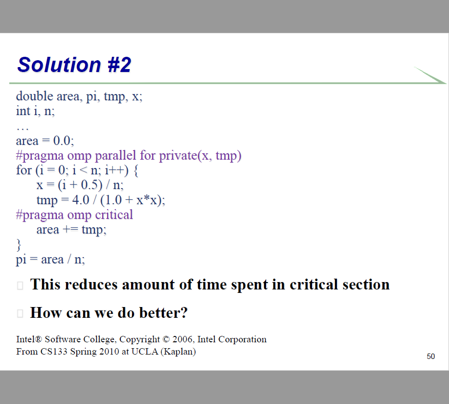
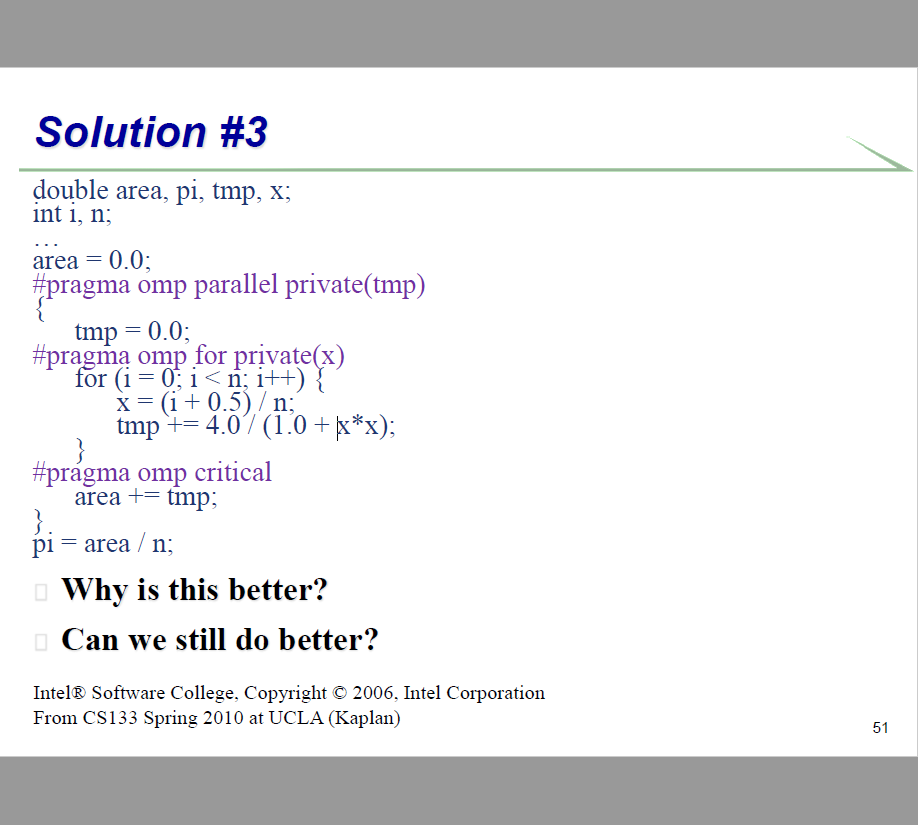
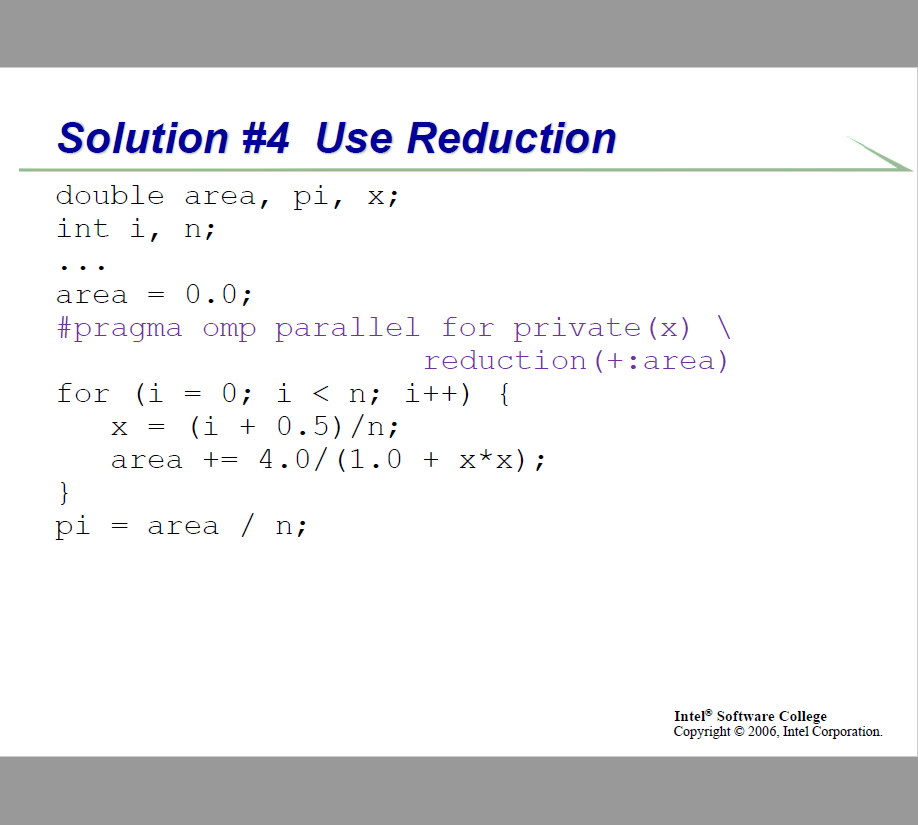

# Lecture 5 

这一讲主要介绍了OpenMP中的三种同步机制Barrier、Mutual Exclusion、Memory fence, 介绍了它们各自的作用以及在OpenMP中的写法，并对它们进行了对比。

Barrier：不同线程对同一段代码的同步

Mutual Exclusion：不同线程对同一个共享资源的互斥

Memory fence: *单一线程*的和memory访问顺序

## 1) Barrier

线程级同步，在Barrier位置要等到该组所有线程结束才继续执行。

OpenMp中Barrier相关操作:

1. 显式Barrier :  #pragma omp barrier
2. 隐式Barrier :  for、single等结束位置自动有Barrier
3. 关闭隐式Barrier： pragma最后加上nowait

## 2) Mutual Exclusion

资源级同步，在同时只能允许一个线程访问该共享资源。用lock实现（单纯加flag不行，flag的判断和修改不是原子操作）。

Lock: 一类操作，控制对共享资源的访问。（操作系统实现的原子性test-and-set）

OpenMP中的互斥相关操作：

1. #pragma omp critical ：==让下一部分代码只能同时被一个线程执行==，实现了互斥。缺点：1)critical部分只能顺序执行，它保护整个语句的所有过程。2)需要程序员确定critical section（对共享资源的读和写都要保护）。
2. omp_set_lock(&hash_lock[i])：只对该数据lock，更高效（critical中对code进行了lock）。
3. #pragma omp atomic：一种特殊的critical，只支持++、--、+=、-=、*=等。只作用于单个语句. 即使一条语句很复杂,只有最外层的读取左边值+做运算+写回这三个操作是原子的.

三种互斥的对比: critical最普适,作用范围最广,但最慢. 另外两种只对一个特定数据lock,更高效.

## 3) critical写法优化的例子

 critical至少有两个缺点：1)同一时刻只有一个人在加法  2) critical和lock都有overhead. critical保护了整句话，但等式右边乘法除法不需要被保护，浪费了

数一数进出了几次critical section: solution2：进出了n次。solution3：进入了num_thread次！num_thread一般更小。solution3通过引入局部变量, 让进出critical的overhead变小.  

 reduce更好了一点,它的累加可以不是sequntial的

## 4) Memory Fences

语法: #pragma omp flush (\<variable-list>)

执行到该处,把所有还未写回的共享变量写回. (确保在任意线程中的共享变量都是相同的值).

在需要进行共享的parallel, for, barrier等处已经有了自动的隐式调用.

flush使用的例子:

flush主要用于不使用复杂pragma,  但想要保证和memory有关的一些顺序时(避免编译器的优化和处理器的乱序执行影响).

## 5) 总结
Barrier：不同线程对同一段代码的同步
Mutual Exclusion：不同线程对同一个共享资源的互斥
Memory fence: *单一线程*的和memory访问顺序

