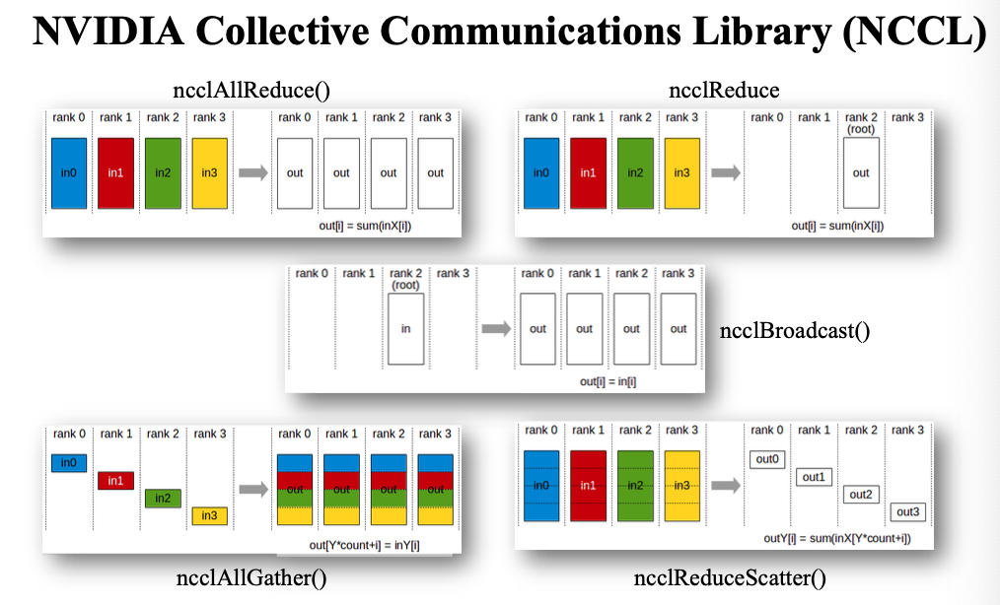

## Lecture 06: Programming with MPI

OpenMP 只要有指针即可交换数据。考虑到数据的延展性，使用 message passing，没有共享地址空间也能交换数据。

能够在分布式计算机上实现共享地址空间。

## Principles of M-P Programming

逻辑上的大机器：将虚拟处理器和独立地址空间抽象成一个节点，p个处理器连接成一个网络。

约束（要程序员来做）：数据被显示的划分（数据具体在大机器的哪个位置？）；两个处理器之间怎么交互？代价程序员可见（代码行数）

异步模式，loosely synchronous（大部分时间自己做自己的，少数同步点）

**SPMD**-single program multiple data 常用模型

## Building blocks: Send & Receive

```c++
send(void *sendbuf, int size, int dest)
receive(void *recvbuf, int size, int source)
//假的API
//P0 P1 有同样的名字但地址不一样
//参数上是buffer地址，实际上传递buffer内容（传值）
```

本地多进程（共享地址空间，但抽象成虚拟处理器）：`memcpy`，网络：`socket`。

## MPI: Message Passing Interface

编程标准，只要6函数就能实现完整功能程序。

NVIDIA Collective Communication Library(NCCL)，连接多 GPU。显存之间独立地址空间。

```c
ncclBroadcast() //数据在一个节点上，传播到多个节点
ncclAllGather() //分布在多节点上的，集合到每个处理器上
ncclReduce()
ncclScatter() //AllGather反过来
```



`4 APIs + send/recv`

建立/终止一个环境`MPI_Init; MPI_Finalize`，总共多少线程 `MPI_Comm_size`，自己是第几个进程 `MIP_Comm_rank`

### 编译运行

编译：

```bash
mpicc -o foo foo.c
mpic++ -o bar bar.cpp
mpicc --show #实际上调了gcc，链接时加了一些库，是一个wrapper
```

运行：

```bash
mpirun -np 4 foo  #SPMD
mpirun -np 2 foo : -np 4 bar #环境中包含六个进程，MPMD
#-hostfile -host，可以分配到多机器上运行
```

两种 hello world 的方式 P19 & P20

- SPMD，master&slave 一个程序，if else 分配任务，开始建立 8 个进程

- MPMD，两个程序命令行：

- ```bash
  mpirun -np 1 ./master : -np 7 ./slave
  ```

host file：

```bash
ceca2 slots=2 max_slots=8
ceca3 slots=2 max_slots=8
#指定有几个机器，每次两个两个分，最多分8个。每个机器负载小，让slots小一点
#分配时先满足每个进程的slots，剩下的部分从第一个进程开始分
mpirun -hostfile <file> -np 5 ./hello
	3 processes on ceca2, and 2 process on ceca3
```

### MPI Message

```c
data:(address, count, datatype) 
//复杂一点的数据类型，如链表（包含下一个的地址），这个就对MPI意义不大，指的是原来链表的地址
message:(data, tag)
//tag粗略认为是data的名字
//两个特殊的tag:MPI_ANY_SOURCE和MPI_ANY_TAG
```

### Send & Receive

- 没有缓存，阻塞的：满足条件后返回
- 有缓存
- 非阻塞：直接返回

https://blog.csdn.net/weixin_38087754/article/details/104726968有详细一些的介绍

```c
int MPI_Send(void *buf, int count, MPI_Datatype datatype, 
             int dest, int tag, MPI_Comm comm)
//前四个是上面说的data。comm：如果所有进程的一个小组之间交互，可以简化进程号码。
int MPI_Recv(void *buf, int count, MPI_Datatype datatype, 
             int source, int tag, MPI_Comm comm, MPI_Status *status)
/*****blocking*****/
//MPI_Send，有buffer但程序员不可见，return until you can use the send buffer(blocking)
//MPI_Bsend，buffer由用户提供
//MPI_Ssend，确定接收方已经调用了MPI_Srecive，有同步含义
//MPI_Rsend，程序员需要确保对应的Rrecieve已经被调用(冒险，但降低开销)

/*****non-blocking*****/
//MPI_Isend，无阻塞，但不能马上改buffer的内容，需要通过 MPI_Test()检查buffer可被安全修改/MPI_Wait()
```

### MPI实现集体通信

- one -> all broadcast, all -> one reduction, all -> all broadcast

- gather, scatter

- example: 矩阵向量乘法，假设乘法迭代进行，输入输出形式一样

  - 按行来分，做内积，每个进程得到一个结果（向量的一行）。通过`all-gather`，保证每个进程得到所有的数据。
  - 按列分，每个进程得到一个向量，需要`all-to-all exchange`，类似于矩阵转置。
  - 矩阵开始时没有划分，在同一个进程上，用`scatter`。

- ```c
  int MPI_Allgatherv (
      void *send_buffer,
      int send_cnt,
      MPI_Datatype send_type,
      void *receive_buffer,
      int *receive_cnt,
      int *receive_disp,  //每一段放置位置
      MPI_Datatype receive_type,
      MPI_Comm communicator)
  //每个进程都会调这个函数，具体参数含义见P49图
  ```
