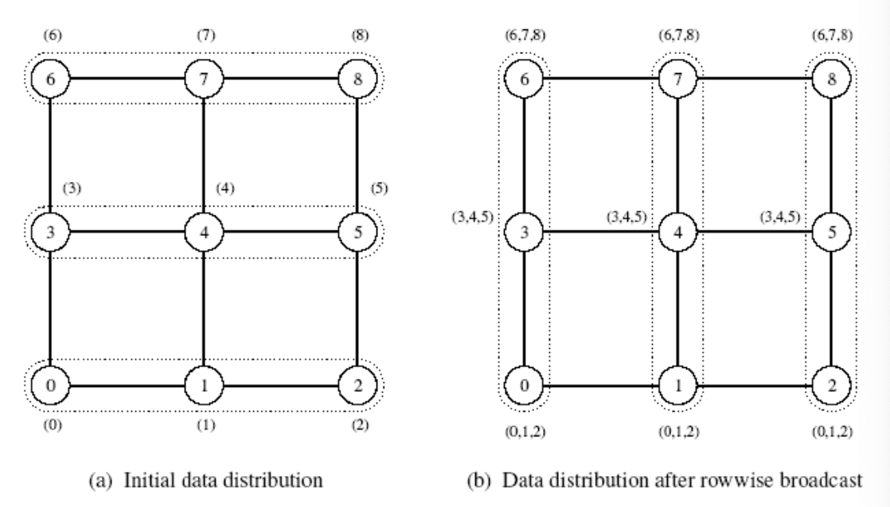

# Lecture 07: Programming with MPI Communications

## Collective Communications

* One-to-All Broadcast & All-to-One Reduction
* All-to-All Broadcast & All-to-All Reduction
* Scatter & Gather
* All-to-All Personalized Communication

以上四组都是对偶的communication operation(最后一组自己与自己对偶)，只需要分析其中的一个，信息传递的逆途径就是另外一个。

## One-to-All Broadcast and All-to-One reduction

最暴力的方法就是一个一个发给$p-1$个线程，时间代价为$O(Mp)$，和线程数量的关系是线性的，非常低效

当从第一个发到第二个的时候，就有两个线程拥有数据了，可以都像其他的线程来进行传输，能够提高效率。从$O(Mp)$降到$O(M\log p)$。

### Ring

可以发现，在ring上每次所占用的通道都不一样，不会发生拥堵的情况。

### Mesh

二维首先变成两个维度的叠加，首先在一个维度的头上传播，之后再从每个头往对应的分组进行传播。 

从下图理解就是首先在最下面一行传播，最后一行的每个线程都得到数据之后，根据每一列向上传播。

### Hypercube

传播的时候向Hamming Distance为1的距离进行传播，实际上是$2^k$个线程，每一次填补上一个维度就好。

## 点对点消息传输时间建模

* Setup time($t_s$) 只有自身决定的时间（与message大小无关）
  * 准备数据的时间
  * routing算法的时间
  * 建立连接的时间
* Per-hop time($t_h$) 和路径长度有关
  * 两个直接连接节点之间的传播时间
* Per-word transfer time($t_w$) 和消息长度有关
  * 传播一个单位数据所消耗的时间

$$
t_{comm} = t_s + l t_h + mt_w
$$
由于：

1. 难以知道传输路径的确切长度
2. 很多结构都依赖于随机化的路由算法，全选最短路可能会拥堵造成效率下降
3. 并且$t_h$通常是比$t_w$要小许多的（速度尚可，带宽不够）

所以通常选择下面的简化模型来考虑时间：
$$
t_{comm} = t_s + mt_w
$$
所以对于前面的broadcast可以知道总时间应当是：
$$
T = (t_s + m t_w)\log p
$$
这种分析方式只有在对channel不冲突的情况下比较有效，如果一条channel上有许多信息同时传输可能会导致效率下降，上面的模型会不准确。

## Gather and Scatter

Broadcast是同一份信息，但是Scatter只是部分的信息。可以考虑采用同Broadcast同样的方法，传输的是子问题当中所有信息的集合。然后再去解决子问题。最终得到的结果应当是：
$$
\begin{align}
T 
&= \sum_{i=1}^{\log p} t_s + m2^{i-1}t_w\\
&= t_s \log p + m t_w (p-1)
\end{align}
$$

## All-to-All Broadcast and Reduction

最简单的方法就是进行多次的one-to-all broadcast。

更高效的方法可以在传递消息的时候进行消息的合并，简单可以看下图：

由于已经知道了一维上面的做法，对于mesh和hypercube都是进行分维度的进行all-to-all broadcast。

对于时间分析ring:
$$
T = (t_s + m t_w)(p-1)
$$
mesh:

$$
T = 2t_s(\sqrt p -1 ) + m t_w (p - 1)
$$
hypercube

$$
\begin{align}
T &= \sum_{i=1}^{\log p} (t_s + 2^{i-1}t_w m)
\\
&= t_s \log p + m t_w (p-1)
\end{align}
$$

## All-to-All Personalized Communication

有点类似于矩阵转置

### Ring

每次传输留下仅自己所需要的内容，剩下的传输出去：

时间分析：
$$
T =
$$

### Mesh

还是进行分维度的处理

时间分析：
$$
T=\left(2 t_{s}+t_{w} m p\right)(\sqrt{p}-1)
$$

## Hypercube

按维度进行子问题的划分，将该维度另一侧所需要的所有数据传输过去，一次传输之后，之后这维度上的0和1两个节点集合的信息总和上都有着全部的数据

时间分析：
$$
T=\left(t_{s}+t_{w} m p / 2\right) \log p
$$
在对于长信息的情况下m很大，后面一项占据了主要的部分，这样进行传输就不会一个时间上最优的解法。

E-Cube Routing：

时间分析：
$$
T=\left(t_{s}+t_{w} m\right)(p-1)
$$
渐进复杂度上对于message size是最优的。

## MPI相关操作

对应操作在MPI当中的对应支持（不需要自己实现具体内容）：

