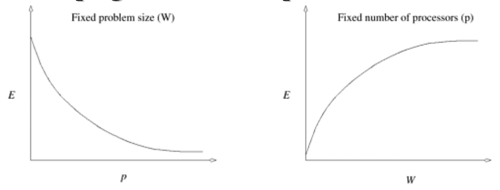
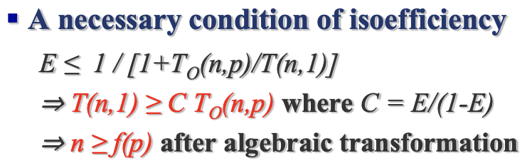
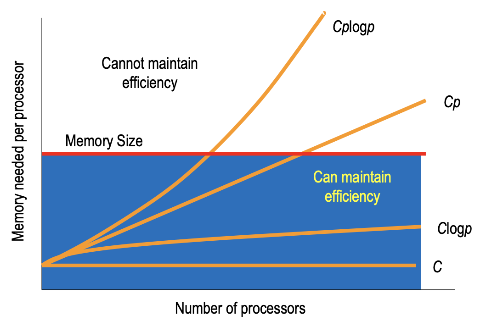
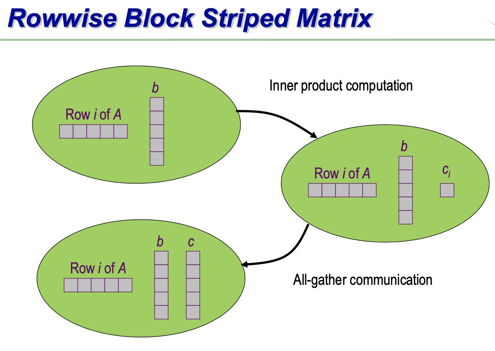
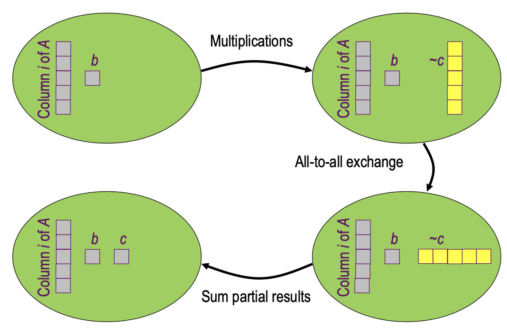
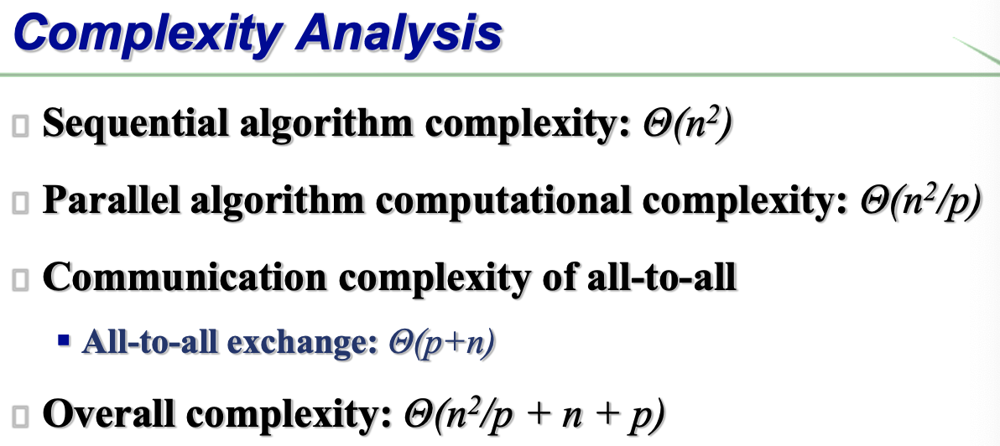
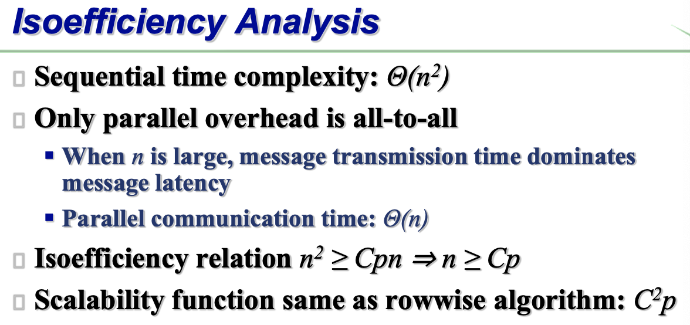
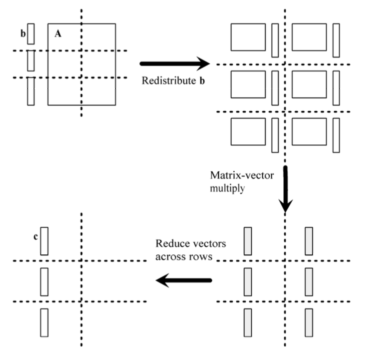
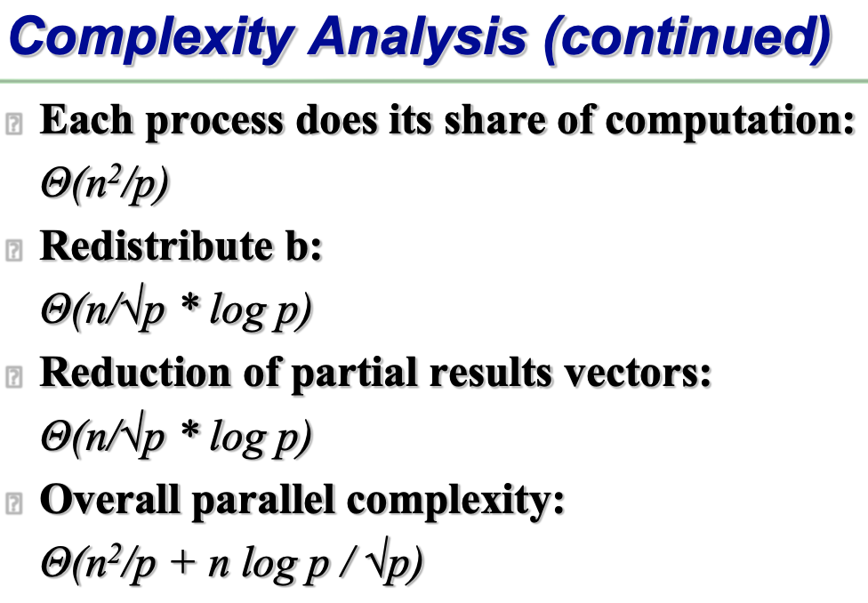
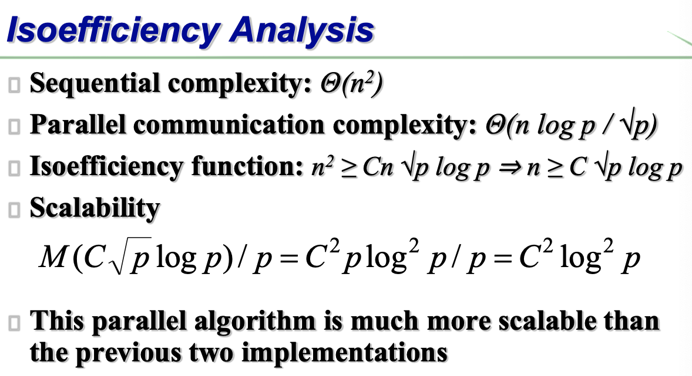

# Lecture 08:Programming with MPI Scalibility&Mixed MPI+OpenMP

本节分析算法的可扩展性

可扩展性良好：随着处理器数目增多、问题规模增大，效率不减、且每个处理器所需的内存有界

## 概念：Speedup & efficiency

####  Execution time

$$
T(n,p)\geq\sigma(n)+\phi(n)/p+\kappa(n,p)
$$

$\sigma(n)$：串行；$\phi(n)/p$：并行；$\kappa(n,p)$：communication

#### Speedup

$$
S(n,p)=T(n,1)/T(n,p)\\\leq(\sigma(n)+\phi(n))/(\sigma(n)+\phi(n)/p+\kappa(n,p))
$$

#### Cost（处理器数目与时间之积）

$$
Cost(n,p)=p*T(n,p)
$$

#### Efficiency

$$
E(n,p)=Cost(n,1)/Cost(n,p)\\
=\frac{1}{1+T_O(n,p)/T(n,1)}
$$

==多数情况下$E(n,p)\leq1$（并行开销更大）==

==$E(n,p)>1$（串行开销更大）的特殊情况：搜索==

#### Total parallel overhead

$$
T_O(n,p) = Cost(n,p)-Cost(n,1)\\
=pT(n,p)-T(n,1)\\
\geq(p-1)\sigma(n)+p\cdot\kappa(n,p)/T(n,1)
$$

## 影响并行程序效率的因素

问题规模n，处理器个数p

固定n，p增加时，$T_O(n,p)$增加，efficiency减少

固定p，n增加，efficiency增加

## Isoeffciency

为保持效率，在处理器数目增加的时候，问题规模也要增加（有一个不等式关系）

$f(p)$越低，可扩展性越好

### Scalability Function

#### 定义

设isoeffciency function是$n\geq f(p)$

$M(n)$表示问题规模为n时所需要的总的存储空间

$M(f(p))/p$表示在保持效率不变的情况下，每个处理器所需的最小存储空间

称$M(f(p))/p$为scalability function

#### 含义

$M(f(p))/p$表示：为了保持效率，每个处理器所需的内存空间会随处理器数目怎样增加

$M(f(p))/p$为常数：可扩展性最佳（可以任意增加处理器数目）

#### 对于矩阵和向量的乘积运算，不同算法的Scalability

##### 按行划分：$C^2p$

###### 复杂度分析

串行：$\Theta(n^2)$

并行：

​	计算部分：$\Theta(n^2/p)$

​	communication(all-to-all broadcast,hypercube algorithm)：$\Theta(logp+n/p*(p-1))$

​	总复杂度：$\Theta(n^2/p+n+logp)$

###### Isoefficiency Analysis

串行：$\Theta(n^2)$

并行：

​	overhead在于all-to-all broadcast即$\Theta(logp+n/p*(p-1))$，n足够大时，只含p的项可以忽略→communication time:$\Theta(n)$

Scalability function：
$$
n^2\geq Cpn\Rightarrow n\geq Cp\\
(即f(p)=Cp)\\
Memory\; utilization:M(n)=n^2\\
Scalability\;function:M(Cp)/p=C^2p^2/p=C^2p
$$

##### 按列划分：$C^2p$

##### 棋盘划分：$C^2log^2p$

假设p为平方数

