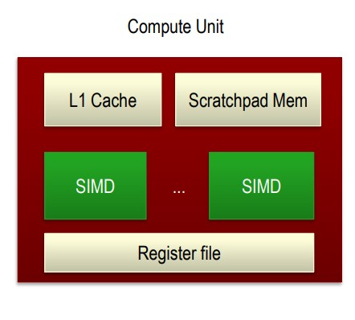
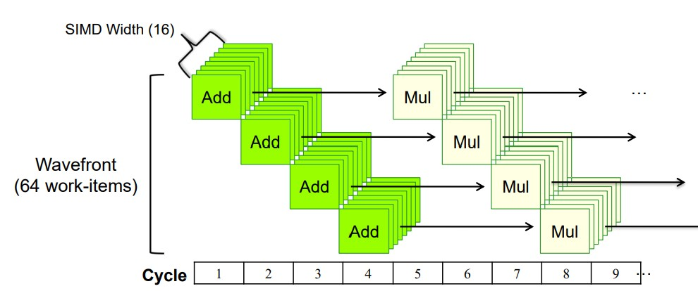
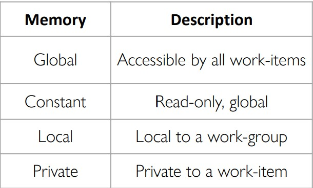
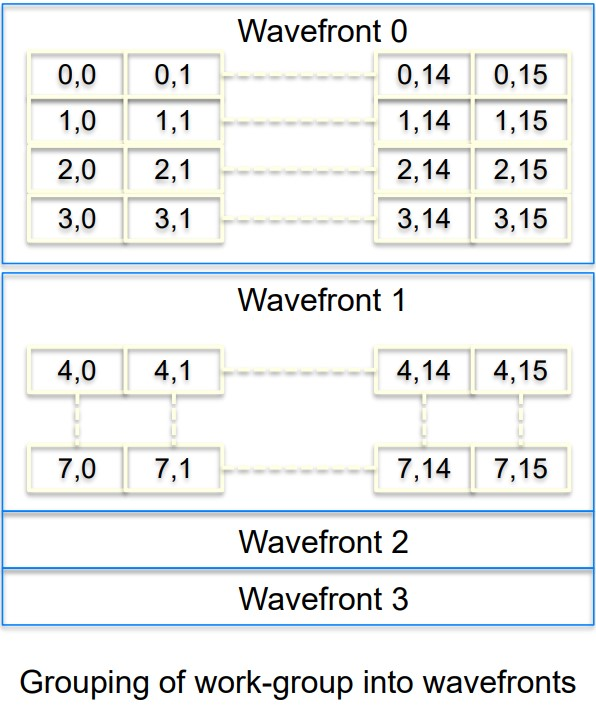
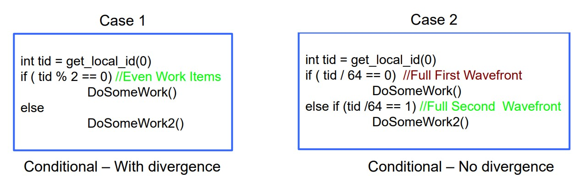
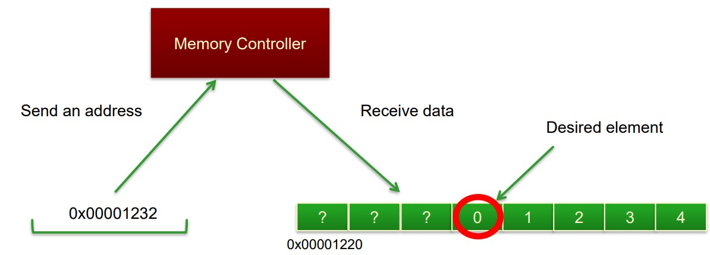
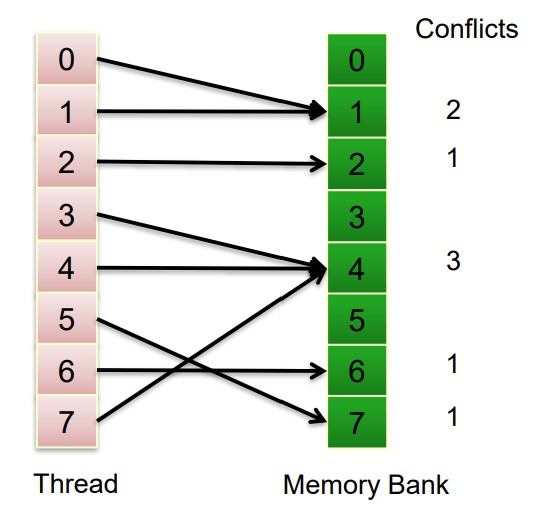

# OpenCL: thread structure & memory model

## last lecture

### image rotation src

```c++
__kernel void image_rotate(
		__global float * src_data, __global float * dest_data,//Data in global memory
		int W, int H, //Image Dimensions
		float sinTheta, float cosTheta ) //Rotation Parameters
{
//Thread gets its index within index space
    const int ix = get_global_id(0);
    const int iy = get_global_id(1);
//Calculate location of data to move into ix and iy– Output decomposition as mentioned
    float xpos = ( ((float) ix)*cosTheta + ((float)iy )*sinTheta);
    float ypos = ( ((float) iy)*cosTheta - ((float)ix)*sinTheta);
    if (( ((int)xpos>=0) && ((int)xpos< W))) //Bound Checking
    && (((int)ypos>=0) && ((int)ypos< H)))
    {
    //Read (xpos,ypos) src_data and store at (ix,iy) in dest_data
    	dest_data[iy*W+ix] = src_data[(int)(floor(ypos*W+xpos))];
    }
}
```

### simple matrix multiply src

把输出划分成小元素，描述了一个single work-item的task。

```c++
__kernel void simpleMultiply(
  	__global float* c, int Wa, int Wb,
    __global float* a, __global float* b) 
{
    //Get global position in Y direction
    int row = get_global_id(1);
    //Get global position in X direction
    int col = get_global_id(0);
    float sum = 0.0f;
    //Calculate result of one element
    for (int i = 0; i < Wa; i++) 
    {
        sum +=
        a[row*Wa+i] * b[i*Wb+col];
    }
	c[row*Wb+col] = sum;
}

```

## CPU/GPU architecture

### CPU

优化单个线程的延迟，能够有效率的处理控制流。许多的空间用于多级缓存和控制逻辑，由于线程少，寄存器数目较少。控制逻辑：将指令重排，乱序执行，提供指令级并行，最小化pipeline stalls。

### GPU

独立的计算单元阵列Compute Units，用大量的核，缓存尽可能少。有很高的带宽。 核与内存之间不需要保持全局的同步。基于SIMD，每个核平摊一部分。线程上下文切换，不能都放到内存里，有很多register file存储线程状态，保证切换更快。

 一个compute unit模型，scratchpad mem和L1一样快

work-items自动地组合成硬件的thread，AMD-wavefronts，64个一组。 NVIDIA-warps，32个一组。SIMD有16路，而warp比物理SIMD宽，则连续两次在SIMD上执行一条指令（SIMT，与SIMD不同不在一个周期上做完）。



## thread structure

线程结构往往跟数据一致。

### work group

层次化关系：`index space` ，`work group`，`work item`。work-item 可以直接定义在 index space 下唯一标识，也可以定义在 work group 下，通过group ID+local ID标识。hierarchy 对硬件友好，因为在 index space 上全局同步代价太大。 

## memory model

### memory hierarchy

比较特殊：constant，只读不写。local比global快

### memory management

内存对程序员显式，需要在不同层级的memory中移动数据。变量类型，每个变量都要加。`__global, __constant, __local,  __private, __read_only/__write_only` 。kernel 参数只能是 `__global, __constant, __local`。

## GPU Threads & Scheduling

### Work-Item Scheduling

可调度单元(schedulable unit)为warp/wavefront，硬件将work groups集成为wavefront(x轴优先)，同一个wavefront中的线程执行同一条指令。线程有独立的寄存器状态，可自由执行不同的控制逻辑。



### Wavefront Scheduling - AMD

wavefront大小为64，每个周期执行1/4个wavefront，连续四个周期执行完。处理RAW(先写后读)数据依赖：如果一个wavefront中有两个work-item有依赖关系，则要等4个周期让写操作执行完。因为线程很多，此时往流水线中填一个新的线程掩盖前一个wavefront的等待，提高硬件利用率。两组线程执行时，一半的寄存器单元空闲。用hardware的overhead代替上下文切换的overhead，tradeoff是要用更多的寄存器存储活跃线程的状态。NVIDIA类似。

### Warp Voting Example

用于没有原子性内存访问的设备，用图像灰度直方图的计算作为例子。每个warp计算一个子柱状图（如果每个work group计算一个，则耗费较多共享资源）。因为有多个活跃的线程同时访问共享内存，而共享内存每次只能允许一次访问成功（三个线程每个cycle只能成功一个，因此至少要写3个cycle）。为保证某个线程的写操作成功，在local memory中设置标记位表示这个work-item写了data。while循环，如果没有成功，则重复写。

```c++
void addData256(
    volatile __local uint * l_WarpHist,
    uint data, uint workitemTag) {
    unsigned int count;
    do {
        // Read the current value from histogram
        count = l_WarpHist[data] & 0x07FFFFFFU;
        // Add the tag and incremented data to
        // the position in the histogram
        count = workitemTag | (count + 1);
        l_WarpHist[data] = count;
    }
    // Check if the value committed to local memory
    // If not go back in the loop and try again
    while(l_WarpHist[data] != count);
}

```


### Divergent Control Flow

用if/else分支为不同tid分配任务，两种方式开销不同。第一种奇偶线程执行不同任务，第二种前64/后64执行不同任务。对于第一种，GPU设置条件码`Predicate = True for threads 0,2,4,...` `Predicate = False for threads 1,3,5,...`，两种分支的 Predication 不同，最后只保留预测正确的分支。Case 1中，每个workfront都要执行if/else，时间是两倍，每次调度只有一半的结果有用（无效结果被mask掉）；Case 2中，一个workfront执行if分支，另一个执行else。



### Pitfalls of using Wavefront

OpenCL并没有规定不同平台下warp/wavefront的大小，即使知道trick，实现跨平台保证运行效果相对困难。


## Global memory

### memory coalescing

总线宽为32B，只想要4B的integer，则一次取地址浪费28B的数据。如果每个线程都单独取地址，总线利用率为1/8(random)。memory coalescing，64个进程连续访问，总线利用率为：
$$
\frac{4\times16}{32\times 3}=\frac{2}{3}
$$
burst，8B地址，256*32B有用。



## Local memory

### memory banks

连续的data存储在连续的bank当中，因此连续的访问不会造成bank conflicts。如果有冲突则造成latency。每个bank可能只有1/2个读口，1个写口。如果0-7线程访问同一个memory bank，则只需要一次处理时间，将这个data广播给线程。

延迟是连续访问的三倍。

## :question: lockstep​
