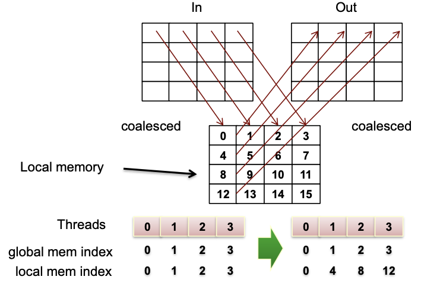

# 11-OpenCL:optimizations & synchronization

## Optimizations

已知设备是什么样，则kernel的代码可以做怎样的调整

- 数据如何映射到线程
- GPU上活跃的线程数（一般来说利用率越高越好） 有几个影响因素
- vectorization

### Thread mapping

#### choosing a proper mapping

eg.矩阵乘法

 index space怎样划分？M\*N or N\*M？——选择N\*M

```c++
//index space: M*N
int tx=get_global_id(0);
int ty=get_global_id(1);
for(i3=0;i3<P;i3++)
    C[tx][ty]+=A[tx][i3]*B[i3][ty];
//index space: N*M
int tx=get_global_id(0);
int ty=get_global_id(1);
for(i3=0;i3<P;i3++)
    C[ty][tx]+=A[ty][i3]*B[i3][tx];
//第二种划分，在访问内存的时候可以达到coalesced accesses
```

#### Optimizing with local memory

eg.矩阵转置

通常的访问方式，不管index space怎么设计，读和写总有一个可以coalesced accesses，另一个不能


利用local memory，读写都可以做到coalesced accesses

需要设置work group



优化后的效果


### Device occupancy

如果资源足够，多个work groups可以放在同一个compute unit里

但是有些条件限制了一个compute unit中可以放置的work group的个数

#### register

编译后确定需要多少寄存器

> 例如，一个compute unit有16384个寄存器，一个线程需要35个寄存器
>
> 则一个compute unit上可以同时执行最多16384/35=468个线程
>
> work group size（一个work group中有多少线程）：
>
> ​	512：不可以；
>
> ​	256：1个work group
>
> ​	128：3个work group

如何在一个compute unit中放入更多work group：可以重构代码，减少每个线程所需的寄存器数

####  Local Memory

常见大小：（不知道有数据没有过时）

- local memory on AMD GPUs:32KB

- local memory on NVIDIA GPUs:32-48KB

local memory大小限制了活跃的work groups的数目

#### Threads

GPU的硬件实现限制了每个work group的最大线程数

- 256 threads per WG(workgroup) on AMD GPUs
- 512 threads per WG on NVIDIA GPUs

NIVIDIA GPU对每个compute unit上活跃的线程数和WG数也有限制

- 768 or 1024 threads per compute unit
- 8 or 16 warps per compute unit

==以上影响Device occupancy的因素之间也会互相影响：==

- 限制因素可能会有线程或wavefront的粒度
- 改变work group的大小，可能会影响寄存器或shared memory使用情况
- 减少其中任意一个因素，可能会让其他work group活跃起来

### Vectorization(矢量化)

向量数据类型：如 float4（4个float那么长的向量）

```c++
//Non-vectorized sum
float x[0]=v[0]+w[0];
float x[1]=v[1]+w[1];
float x[2]=v[2]+w[2];
float x[3]=v[3]+w[3];
//Vectorized sum
float4 x=(float4)(v[0],v[1],v[2],v[3])+(float4)(w[0],w[1],w[2],w[3]);
```

## Synchronization using OpenCL events

- OpenCL的结构：一个host通过管理一组commands管理devices
- command queue
  - In-order queue 按顺序执行
  - Out-of-order queue 发掘任务级并行（但还有一定的顺序→Synchronization）
- 需要Synchronization的情况：out-of-order command queue或multiple command queues

几个管理command queue的函数：

```c++
clFlush(cl_commandqueue);
//把queue中所有的command发送到device中
//返回时不保证他们都执行完了
```

### 粗粒度同步：对于每个command queue

#### Synchronization ==between host and queue==

```c++
clFinish(cl_commandqueue);
//等待queue中所有的command完成，然后才继续（相当于host阻塞在这里）
```

#### Synchronization ==over a queue==

```c++
clEnqueueBarrier(cl_commandqueue);
//设置同步点，保证前面的command都完成了才继续后面的
```

### 细粒度同步：对于每个OpenCL Operation

#### Synchronization ==between host and command==

#### Synchronization ==between commands==

##### clEnqueue*函数的同步

<u>clEnqueueReadBuffer</u> <u>clEnqueueWriteBuffer</u>有一个布尔型的参数表明是否blocking

- blocking：OpenCL用host pointer参数将操作入队列
- non-blocking：函数会立即返回，但host pointer不能被安全地重用
  - clEnqueue*函数返回的event handle可以检查non-blocking操作是否完成

##### OpenCL event

一种数据类型，用于存储device返回的时间信息

###### 获取事件信息

```c++
cl_int clGetEventProfilingInfo ( 
    cl_event event,//event object
    cl_profiling_info param_name,//event object
    size_t param_value_size,//size of memory pointed to by param_value
    void * param_value,//size of memory pointed to by param_value
    size_t * param_value_size_ret)//size of memory pointed to by param_value
```

param_name的取值：


### user events

```c++
//创建user event
cl_event clCreateUserEvent (
    cl_context context, //OpenCL Context
    cl_int *errcode_ret ); //Returned Error Code
//刚创建时execution status为CL_SUBMITTED
//clSetUserEventStatus用于设置一个user event的执行状态
cl_mem clSetUserEventStatus (
    cl_event event, //User event
    cl_int execution_status); //Execution Status
//一个user event只能被设成CL_COMPLETE一次
```

### waitlist

所有clEnqueue*函数都能接受event waitlist

waitlist是元素为cl_event类型的数组

```c++
 err = clWaitOnEvents(1, &read_event);
//排队等待特定事件或事件列表完成，然后再执行在command queue中排队的任何将来的命令
clEnqueueWaitListForEvents( cl_command_queue , int, cl_event *);
//用于同步
clEnqueueMarker( cl_command_queue, cl_event *);
```

### event callbacks

```c++
cl_int clSetEventCallback (
    cl_event event, //Event Name
    cl_int command_exec_type , //Status on which callback is invoked 
    void (CL_CALLBACK *pfn_event_notify) //Callback Name
    (cl_event event, cl_int event_command_exec_status, void *user_data), void * user_data) //User Data Passed to callback
```

event相关的函数可以用来测量时间

```c++
clGetEventProfilingInfo( event_time, CL_PROFILING_COMMAND_START, sizeof(cl_ulong), &starttime, NULL);
clGetEventProfilingInfo(event_time, CL_PROFILING_COMMAND_END, sizeof(cl_ulong), &endtime, NULL);
unsigned long elapsed = (unsigned long)(endtime - starttime);
```

### Asynchronous I/O


