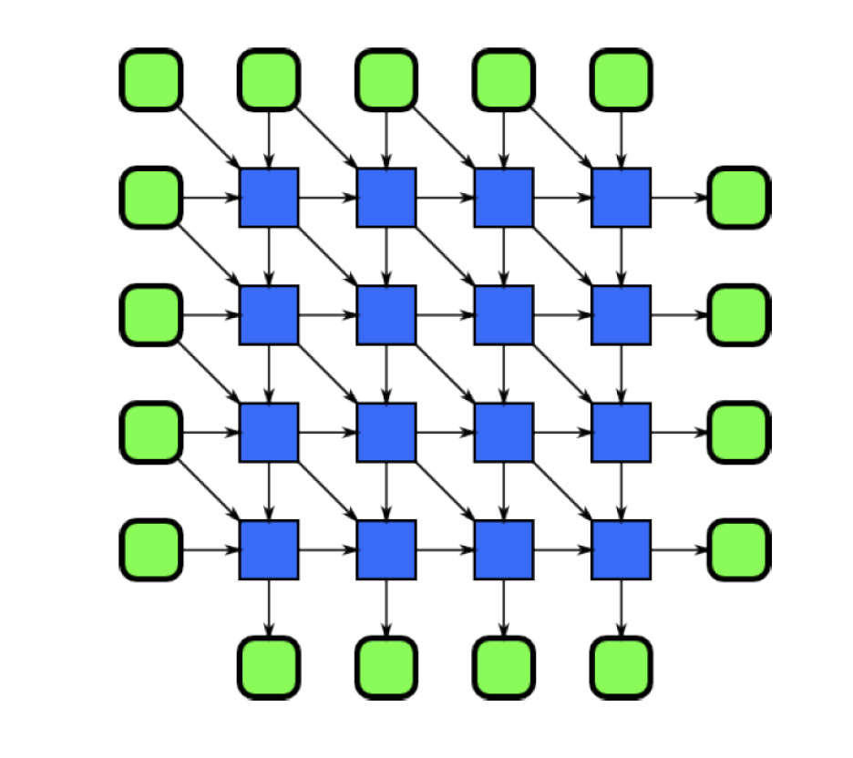

# Parallel Programming Patterns

## Outline

这一章主要分为两个部分，前一部分介绍了一些programming pattern，后一部分介绍的是13个Dwarf，整体为走马观花式的介绍，并没有深入探讨细节。

### Structured programming patterns

* Serial/parallel control flow pattern
* Serial/parallel data management pattern

### Dwarfs of parallel programming

## Parallel Patterns

### Nesting Pattern

 绿色为整个算法的输入输出，蓝色为基本的任务。

层次化的表现，粗粒度看每个小蓝方块都是一个pattern，但是里面展开来可以有其他的pattern。

* Sequence
  * superscalar sequence
    只要满足排序满足数据依赖就可以
    
* Selection
  * speculative selection
    条件和分支可以并发执行的
    
* Iteration
  存在两种，一种是多次循环之间没有关系的，一种是循环之间存在前后依赖的。
* Recursion
  1. 是一种动态形势的nesting，允许自己调用自己
  2. 尾递归可以转化为循环

### 

### Fork-Join

join和barrier不一样

* join结束之后只有一个线程，其他线程不存在了
* barrier之后多个线程一起执行

### Map

### Stencil

相当于是一种广义的Map，Map只能够访问自己的输入，而Stencil还可以访问邻居的输入。

#### 实现

* 1-D

向量化(vectorization) + 平移(Shift)

* N-D

Strip-mining

### Reduction

经多个元素通过一个存在结合律的function合成为一个。拥有结合律就拥有更多优化的可能性。

#### Reduction with Tailing

### Scan

对任意前缀都会算一个和。

Scan通常需要更多的运算，左边为7个，右边为11个。

### Recurrence

如下图实际上反对角线上的运算也是可以并行的，可以看成一种复杂版本的Map。

## Parallel Data Management Patterns

### Pack

清除掉不用的空间。

### Pipeline

### Geometric Decomposition

将数据分成一个个的子集，实际上并不进行数据的移动。

这里可以有overlapping也可以没有。

### Gather

生成和index一样长的output，根据index从input当中取元素

### Scatter

可以看成是Gather的逆过程

可能会出现两个要写入同一个地方的race，可以考虑采用优先级设计，丢弃一个。

## Dwarf

之前所考虑的都是外部的框架结构，但是对于小蓝方格里面的内容并没有细究。这里的Dwarf提出实际上就是为了解决偏实际问题的，一共有13个，在slide当中都只做了简要的介绍以及应用举例，这里只做简单描述。

### Dense-Linear-Algebra Dwarf

串行的优化通常是做block。（类似于ics的lab里面对于局部性做的优化）

### Sparse-Linear-Algebra Dwarf

稀疏矩阵由于存储方法不一样会又不一样

### Structured-Grid Dwarf

通常是可以静态分析的，所以可以通过预取。

### Unstructured-Grid Dwarf

### Spectral Dwarf

FFT

### N-Body Dwarf

为了解决N体问题的实际情况所设计的。实际较远节点当中细微的变化没有特别重要，所以可以考虑将一块区域内的点看做一个整体来进行运算，如slide里面所提到的四叉树的模型。

### The MapReduce Dwarf

MapReduce在之前已经说过了

### The Dynamic-Programming Dwarf

### The Graph-Traversal Dwarf

通过图上的连接边来访问对象的图模型。

### The Graphical-Model Dwarf

节点代表变量，边代表条件概率的图模型。

### The Backtrack and Branch-and-Bound Dwarf

回溯与分支限界

### Combinational-Logic Dwarf

比较细的位运算

### The Finite-State-Machine Dwarf

