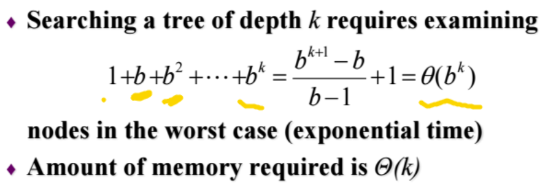
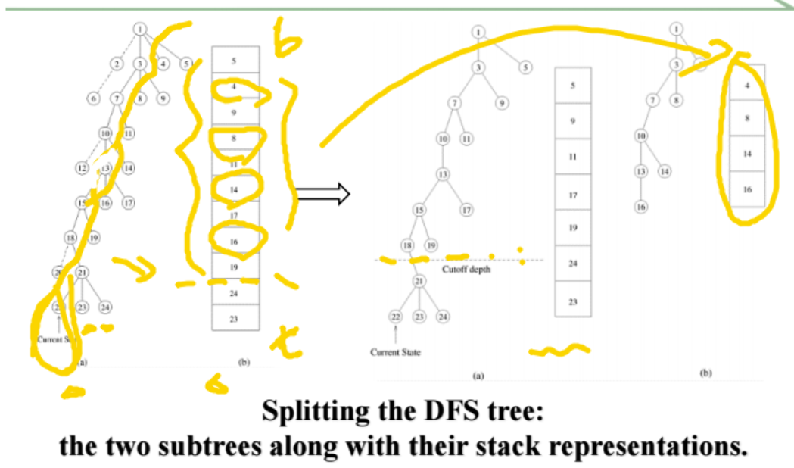
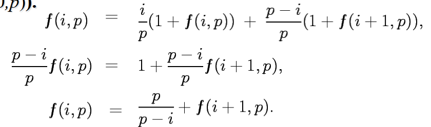
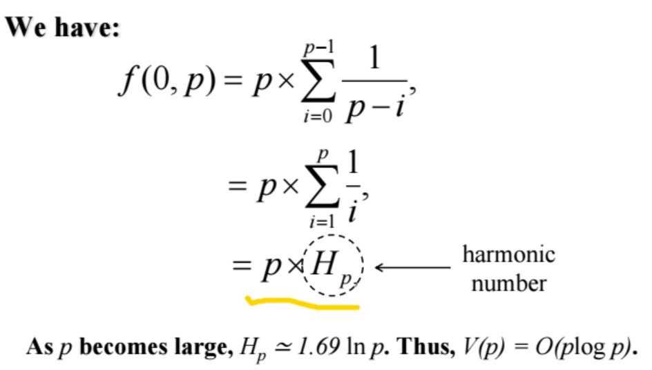

# Selected Parallel Algorithms Discrete Search

## Outline

下面几章以应用parallel的算法为主

- Depth-first search（stack）
  - 如何平衡各个处理器之间的工作量
  - 在组合优化问题中，会定义estimate function，预估某个分支更有希望搜索到，从而去扩展该分支
- Best-first search（priority queue）
- Speedup anomalies

## 经典搜索问题

围棋：剪枝/扩展分支

DFS：从根到叶子遍历

BFS：扩展分支前会判断哪个子树更有希望（从根开始判断、扩展几步后再判断接下来几步的可能性）

## Depth-First Search

### 时间、空间复杂度

Branching factor (b): the (average) number of children at each node 考虑了剪枝之后的平均扩展度

### Parallel DFS

#### 第一种想法：给每个处理器分配一棵子树

扩展到k层后，有b^k个子树，如果有b^k个处理器，就可以直接每个处理器分配一棵子树

若p≠b^k，则越往下，子树越多，分配的灵活性更大，可以在处理器之间进行任务量均衡，但这样会使串行的时间增加（存在trade off）

直接给每个进程分配一棵子树的劣势是子树之间工作量差异很大，但子树的大小很难预测，因此需要动态均衡（dynamic load balancing）

#### Dynamic Load Balancing

##### 处理器的两种状态：

- Processor active：进行任务/处理收到的请求任务信息
- Processor idle：向其他处理器发送请求任务/处理收到的请求任务信息（别的处理器不一定知道这个处理器处于idle状态，因此即使idle状态也可能收到请求任务的信息）

##### 步骤：

- 整个空间从一个处理器开始（一个处理器active，其他全部idle）
- 一旦一个处理器做完了手上的任务，就会向其他处理器请求任务
- 处理器中以local stacks存储未处理的状态/结点
- 一个处理器找到解后，所有处理器终止

##### Work Splitting：

概念：

- Donor process：向别的处理器发送任务
- Recipient process：请求任务
- Half-split：直接均分（理想中的状态，但现实中不存在）
- Cutoff depth：避免分配太小的子树

越靠近栈底，子树可能越大，因此可以把栈底的一些节点间隔分配出去（如果分配连续几个节点很容易把小的几个子树分配给同一个处理器，导致下一次分配的不均衡）

##### Load-Balancing Schemes：

###### 该找哪个处理器请求任务？

1. Asynchronous round robin：每个处理器都有个计数器，按序号依次找处理器请求任务（缺点：一开始全找0号，下一次全找1号，会造成后面的处理器任务积累）
2. Global round robin：全局计数器
3. Random polling：随机请求

###### Analyzing DFS：

规模：n

串行时间：W

并行时间：Wp

分析total number of requests：如果一开始分配得均衡，则处理器之间请求会很少

定义α（0<α≤0.5），来衡量一个处理器分配给两个处理器的任务量是否出现过度不均，每个处理器的任务都不少于αw，不多于(1-α)w。α为全局固定

V(P)：保证经过V(P)次请求后，每个处理器都收到过一次请求（注意：V(P)>p）

两次请求之间有处理任务时间，这个时间是线性的，但由于处理器分配时工作量以指数减少，因此忽略掉先行递减的时间。

经过V(P)次请求后，每个处理器的最大工作量为(1-α)W；2V(P)次请求后，最大工作量为((1-α)^2)W……

总的请求数为O(V(P) log W)		（重点在于分析V(P)的大小）

Asynchronous Round Robin：最坏情况下V(P)=O(p^2)	（按序号每个进程都被各个进程请求一次）

Global Round Robin：V(p)=p

Random Polling：

- 最坏情况下V(p)无上限（即某一个进程一直没有被请求到），一般用平均情况
- F(i,p)：i表示已被请求的进程数，p表示总进程数（p-i没被请求）
- f(i,p)：F(i,p)到F(p,p)的平均请求数，我们要求的是f(0,p)
- 

- 

## Best-First Search

Lower Bound Function：Manhattan distance

已走的步数：depth	还要走的步数：lower bound function

### 具体策略（没有展开讲）

1. Centralized Strategy：优先队列（有一个**公共的**中心优先队列，其他队列向中心优先队列走）
2. Ring Communication Strategy：组成一个环，只和邻居通讯，交换信息慢
3. Blackboard Communication Strategy：每个进程都有一个优先队列，有中央基础设施，交换信息快；可以结合DFS，将结点子树进行随机分配，增加随机性

## Speedup Anomalies

分为acceleration anomalies和deceleration anomalies（了解概念）

## 附录：Distributed Termination Detection

DTD：不需要有中央的机制

终止进程：找到解；收到其他进程的终止信息（不考虑第三条做完任务，因为会找别人要任务）

Distributed termination的问题：所有的进程终止且所有信息已处理（没有在途信息）

用color+message count来记录信息

- 初始：白色，count为0
- 发信息：变黑，count+1
- 收信息：变黑，count-1
- 终止条件：所有都是白色且count总和为0

进程0发送token：

- 其他进程接收token
  - 如果process是黑色：token变黑，process变白
  - 把自己的信息count加入token的信息count
- 进程0接收token
  - 判断终止条件：token白色；进程0白色；token count+process 0 message count=0
  - 否则继续进入ring

