# 16-Sparse Matrix-Vector Multiplication

## Sparse matrix formats and basic SpMV

现实中实际上有着非常多的稀疏矩阵，通常对应于以下的现实问题：

* Sparse matrix-(dense)vector multiplication (SpMV)
  * Solving linear systems
  * Eigenvalue problems
  * Optimization algorithms
  * Machine learning
* Sparse matrix, sparse vector (SpMSpV)
  * Breadth-first earch
  * Bipartite graph matching
  * Maximal independent sets
* Sparse matrix, sparse matrix (SpGEMM)
  * graph algorithms
  * $A*A^T$
* Sparse matrix, dense matrix (SpDM3)
  * Machine learning


Compressed Sparse Row(CSR)存储方法：

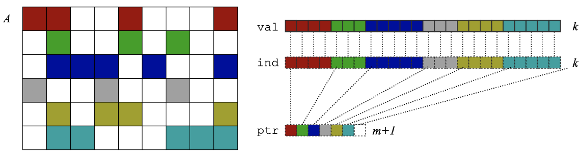

最下方的ptr用来指向的是不同行的起始index，上面存储的是对应行的列坐标，以及对应坐标上的数值，这样相较于存储所有非零的坐标和值而言，能够减少$k-m-1$的存储空间。

一个矩阵-向量相乘的例子如下：

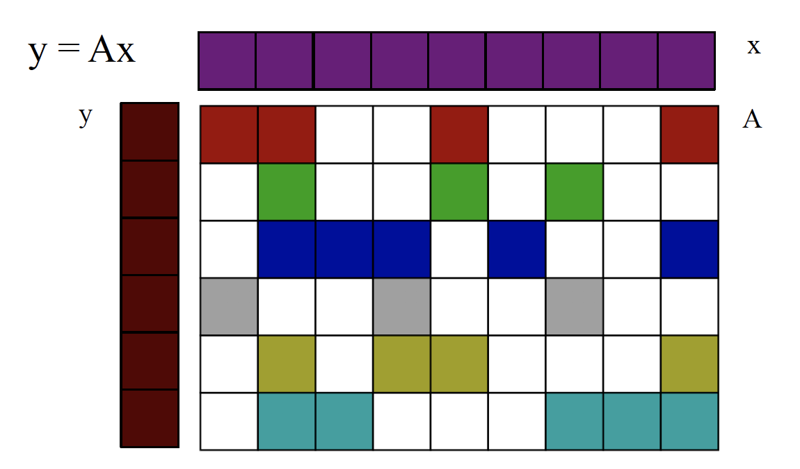

```
for each row i
	for k = ptr[i] to ptr[i+1]-1 do
		y[i] = y[i] + val[k] * x[ind[x]]
```


### Roofline model

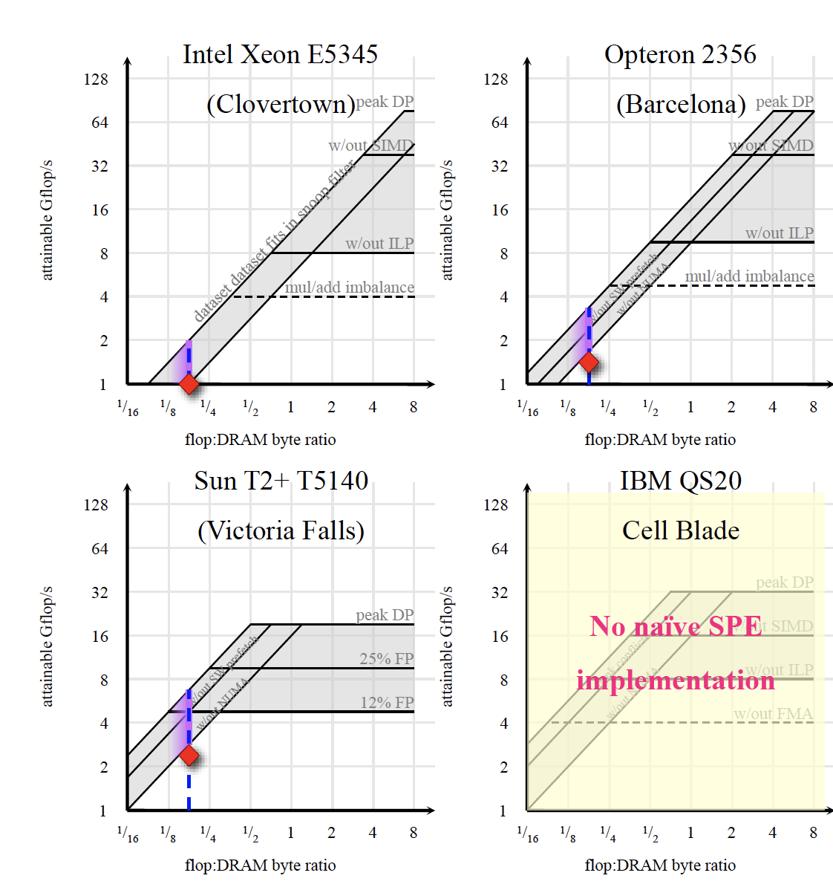

顶上受到的是计算资源的约束，斜边上受到的是存储资源的约束。

## Register blocking and autotuning SpMV

对于有着姣好形式的矩阵，可以利用分块来处理：

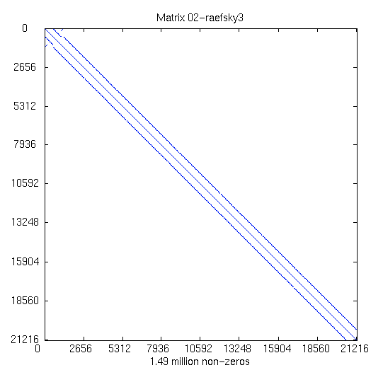

如上图所示的矩阵，通过局部放大可以看到如下的形式：

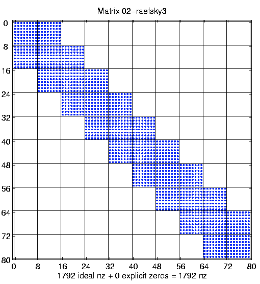

这样看来通过8x8的块进行分块的话，至少从存储空间的缩减上是存在优势的，但是是否能够在计算上得到优势并不一定。通常是利用搜索的方式来对稠密矩阵进行分块的分析，来得到对于特定的及其相应的较优参数。这也是有些矩阵运算的库在安装的时候需要进行大量的计算消耗比较久时间的原因，就是为了来进行一个参数的提前运算，方便后续调用时候的优化。

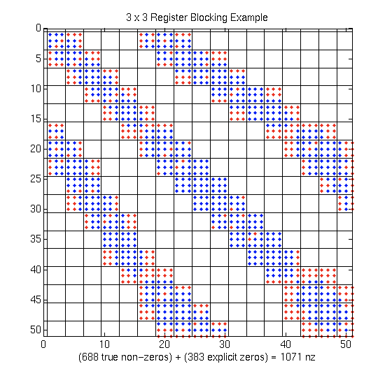

如上图所示的矩阵，这个时候，可能会考虑进行一些补零的操作，虽然总体上增加了运算量，但是在多线程运算的时候可以提升整体的效率。

### Matrix Reordering

矩阵重排可以通过行列的重排来生成更加稠密的块，如下图是一个普通的矩阵：

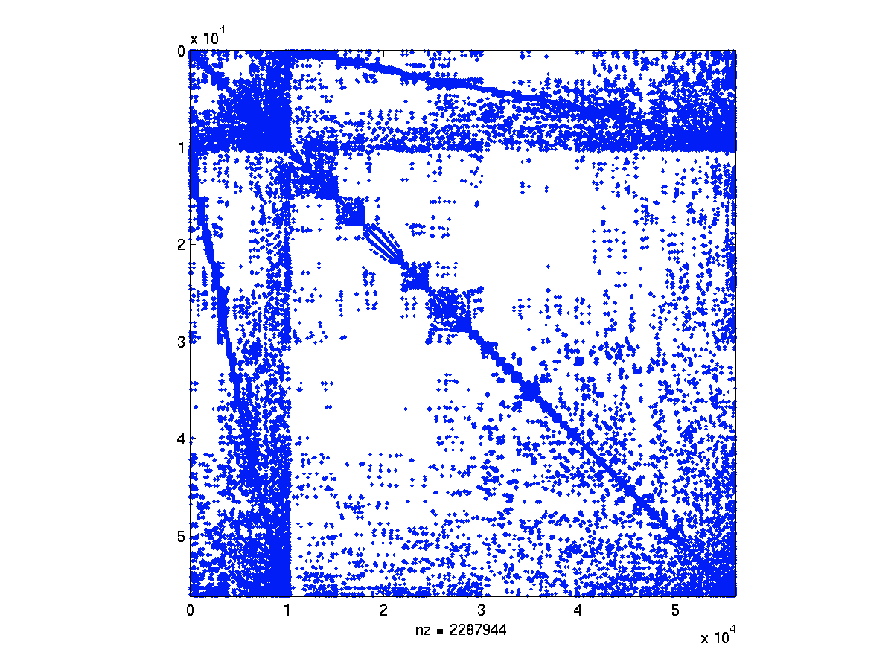

在经过重排之后得到如下结果，大部分都集中在对角线上，在其余部分只有非常少的非零值，对于计算提供了极大便利。

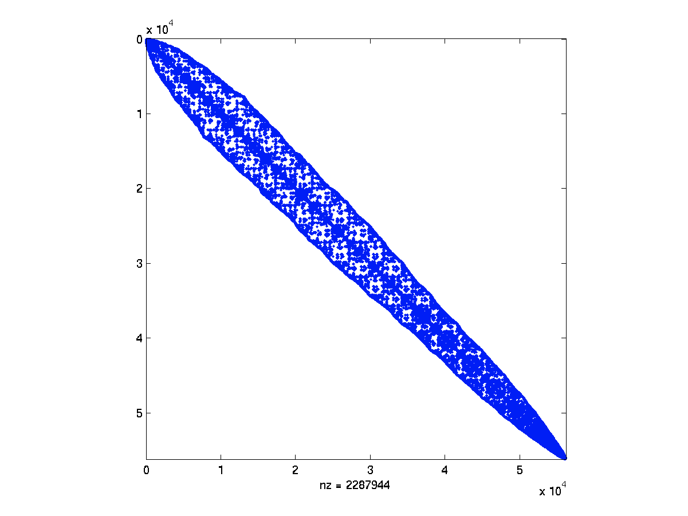

## Cache blocking SpMV on multicore

### Row parallelism

对于一个$y=Ax$这样的问题，$A$是一个系数矩阵。一个比较朴素的想法就是按行进行划分，这样不需要进行跨线程的通信，也就不存在race或者lock的问题。

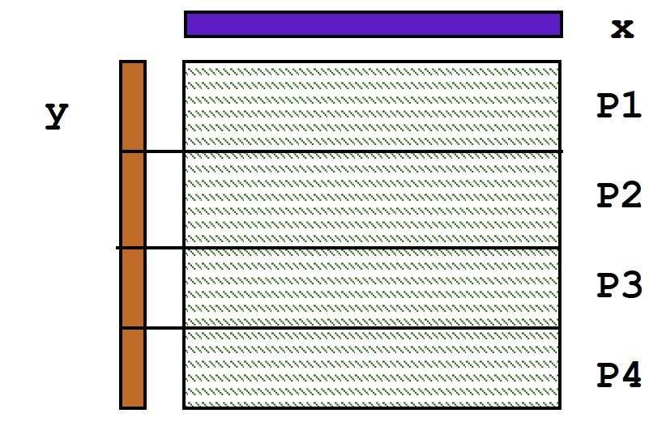

但是注意的是，对于系数矩阵，按行数进行划分并不能很好地实现负载均衡，还是应当对于非零值的个数进行较为均衡的划分。


## Distributed memory

我感觉只要还是Blocking和Reordering的方法，没有什么细节只是概述，想详细了解可以看看slide。


## Sparse matmult

这一部分没有什么细节，有了解需求可以看看slide。


## CA iterative solvers

CA指的是Cache Avoidance，由于计算机的存储设备有一个分层的设计，所以实际上有很多时间都花费在了访存上面，如下图所示：

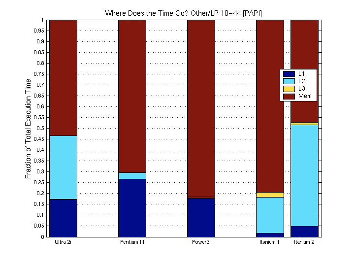

一个很简单的迭代求解的问题，$y=Ax$，需要进行k次迭代，容易发现实际上各个线程当中的结果是存在依赖关系的：

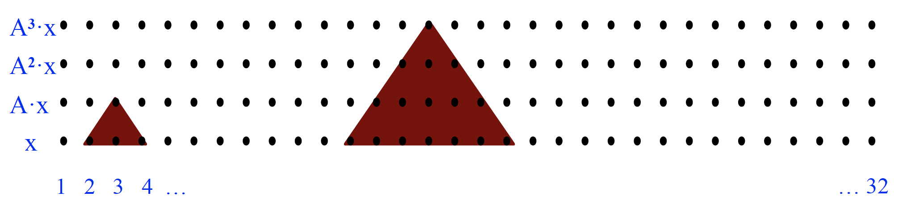

对于一个Sequential的方法而言，可以一个一个step右移：

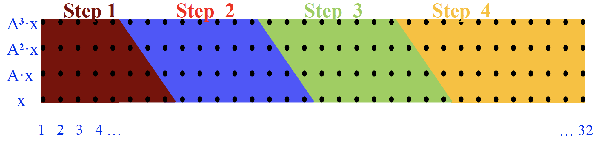

而对于Parallel的方法，事实上会让每个进程去计算比实际分配更多一些内容：

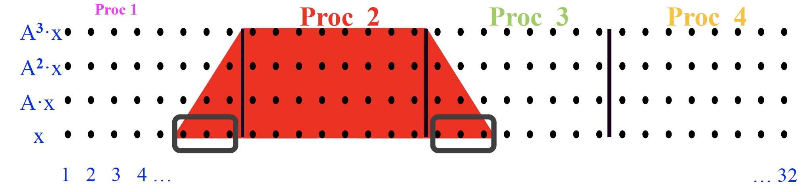

比如上面梯形部分的两个脚就是overlap的，虽然会在多个进程中重复计算，但是这样可以避免产生额外的通信。

对于图结构也可以有如上的方法：

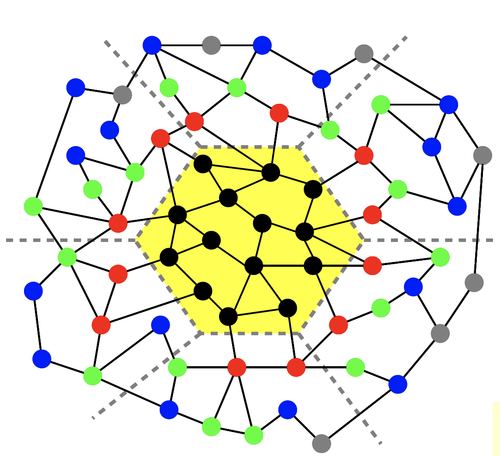

中心部分进行数次迭代只会依赖于外侧部分的内容，在中心部分以外的就是会被重复计算的地方。