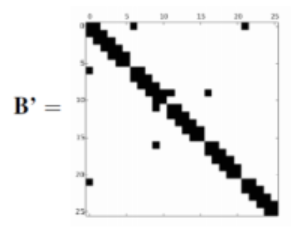
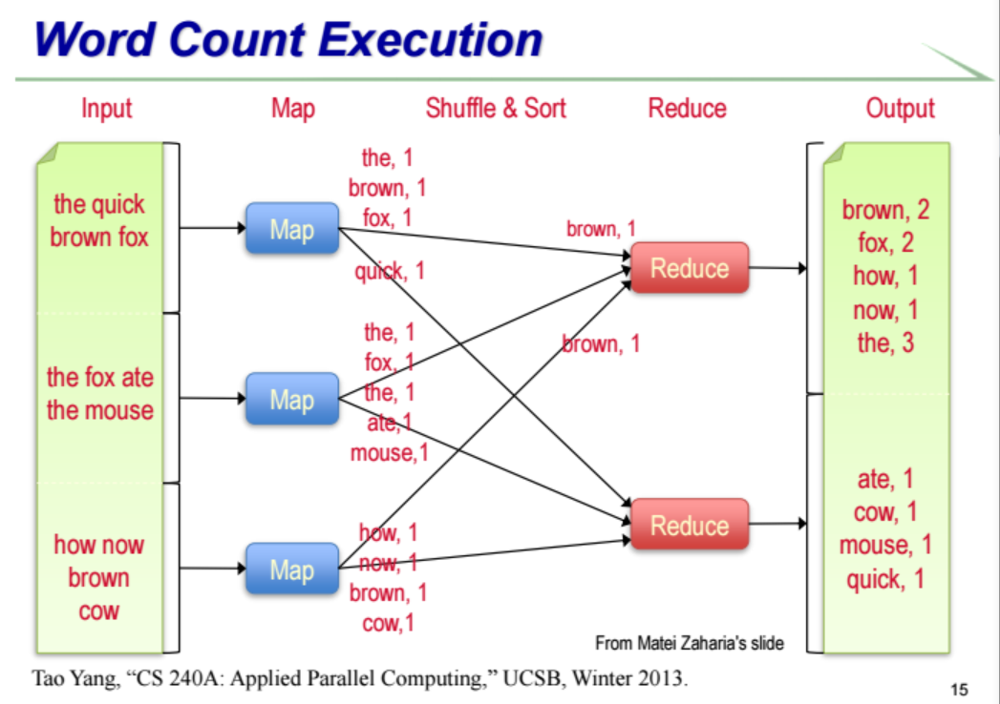

# Parallel Programming with MapReduce

## 考核

20%HW+10%WrittenSurvey+15%MiniProject+55%Final（比例可能调整）

### 期末考试

开卷+摄像头（ClassIn）

### 大作业：脑神经

神经元之间电流传播建模，如何模拟神经元

软件：Neuron（用的最多） Genesis CoreNeuron

如果编号编得好，那么相邻编号的神经元有链接，则主对角线、副对角线有值，而偏离对角线的则表示有分叉。如果没有分叉，是一条链，则只有主对角线、副对角线有值。

神经元可以抽象为树，根结点编号为0，以深度优先的顺序编号。

project包里有论文详细说明Hines算法，但论文中的Hines算法的边界有点问题（Backward Sweep中循环边界），以大作业要求pdf中的伪代码为准。

后期会给所有人注册服务器，如果不想交到教学网，也可以放在服务器上。

### Short Survey

总结任何关于课程内容的话题的几篇论文，篇幅不用太长，两三篇论文的阅读量。不用太细节，需要把主要思想说清楚。

DDL和Project一样。

## MapReduce

原因：更大的数据处理量、大规模并行、处理数据的可靠性

推荐阅读Google关于MapReduce的几篇论文（背景：Google自动检索的需要）

### 集群并行数据处理

实现规模性、成本有效（初期想法：买大量的廉价PC；现在的超算不太一样，每个部件都非常昂贵）

### MapReduce and Hadoop

Hadoop：初始只是想做一个开源引擎，但MR算法出来后马上就实施了这一想法。但Google当时只是把MR用在了公司内部，没有开源。

### Typical Hadoop Cluster

交换机之间不是简单连接，有很多更深入的研究（这里不展开讨论）

### MapReduce编程模型

这个模型存在争议，在理论上没有新的突破，而在工程上与自动化并行有结合，因此有新的发展。

由函数式编程启发：map任务square应用于list中的每个元素；reduce任务+的list中的元素顺序与结果无关（思路：把list分成几块分别求和，再将几块求和--并行）

（讲义map square下一行有错，应该是1 4 9 16）

用户只需要定义好Map、Reduce函数和list内容，提交后系统就可以自动进行划分、并行计算

Map：输入一组key、value，输出一组key、value

Reduce：输入一组key、value，输出一组value

### 例：word counting

Reduce部分前按照key分类（group by key）

### Systems Support for MapReduce

用户要做的只是定义map、reduce和list（用户友好）

看似是单个系统，实际上是分布到各处，有虚拟化的意思。

### GFS/Hadoop DFS假设

假设失败率很高

假设支持的文件比较小

假设文件只写一次，而且是append操作

这些假设很符合搜索引擎建索引的环境

### GFS Design

同一个数据块会分在不同的Chunkserver中，这种冗余会提高容错率（通过replication来实现reliability）

